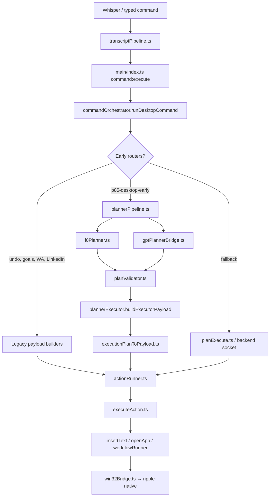

# P8.5 Architecture Audit

**Date:** July 2026  
**Scope:** Ripple Desktop — readiness for Universal Intent Planner (P8.5) and scale to arbitrary natural-language commands  
**Method:** Code trace through `electron/` (orchestrator, planners, execution, native layer)

---

## Executive Summary

Ripple Desktop has a **working P8.5 pipeline** for desktop typing, keys, mouse, and many open/file intents — but it does **not** yet have a single planner entry point. Commands fan out through **15+ parallel routers** in `commandOrchestrator.ts` before some paths ever reach `runPlannerPipelineAsync`.

The P8.5 tool catalog (`toolManifest.json`) is **declarative metadata**, not an executable registry. Plans are bridged into legacy `RippleAction[]` (`INSERT_TEXT`, `WORKFLOW`, …) and executed by one action runner — but **planners still produce payloads differently**.

**Verdict:** P8.5 can be built incrementally on top of existing pieces, but **Phase 0 refactor** should route all commands through Universal Planner with legacy routers as shadow/fallback before adding new tools at scale.

---

## 1. Current Command Flow

### Whisper transcript → action execution

```text
User holds voice hotkey
    ↓
Renderer (Overlay.tsx / Home.tsx)
    ↓  rippleApi.executeCommand({ command })  OR  voice stream → voice:end
    ↓
electron/main/index.ts
    ↓  ipcMain.handle("command:execute")  OR  ipcMain.handle("voice:end")
    ↓
automation/voice/transcriptPipeline.ts   ← FIRST FILE THAT RECEIVES WHISPER TEXT
    processTranscriptFromStt(raw)
      repairCorruptedTranscript
      correctWhisperMishearings
      normalizeTranscript
      preprocessForNlu
    commandTextFromTranscript(snapshot) → final command string
    ↓
services/commandOrchestrator.ts
    runDesktopCommand(input)              ← ROUTER / PLANNER DISPATCH LIVES HERE
    ↓  [many early-exit routers — see §2]
    ↓  P8.5 path:
    agent/planner/plannerPipeline.ts
      normalizeIntent → L0 → validate → cache → grounded → GPT fallback
    agent/planner/plannerExecutor.ts
      buildExecutorPayload → executionPlanToPayload
    ↓
automation/actionRunner.ts
    runCommandActions(payload)
    ↓
automation/executeAction.ts
    executeSingleAction(action)
      WORKFLOW → workflow/workflowRunner.ts
      else     → executeBackendAction.ts
    ↓
automation/actions/insertText.ts  (INSERT_TEXT: keys, text, mouse)
automation/actions/openApp.ts     (OPEN_APP / OPEN_URL)
automation/desktop/runDesktopAction.ts  (WORKFLOW desktop steps)
    ↓
native/win32Bridge.ts
    invokeWin32(...) → ripple-native.exe (Rust sidecar)
```

### Direct answers

| Question | Answer |
|----------|--------|
| **Which file receives the Whisper transcript first?** | `electron/automation/voice/transcriptPipeline.ts` via `processTranscriptFromStt()`, called from `electron/main/index.ts` on both `voice:end` (STT result) and `command:execute` (typed or forwarded text). |
| **Which file decides what planner/router to use?** | `electron/services/commandOrchestrator.ts` — function `runDesktopCommand()`. No central router table; priority is **hardcoded if-chain order**. |
| **Secondary routing inside P8.5** | `electron/agent/planner/plannerPipeline.ts` — L0 → validate → cache → grounded → `gptPlannerBridge.ts`. |

### Call graph (simplified)



---

## 2. Current Routers

Every command router/planner currently used (in **orchestrator priority order**):

| Router ID | File(s) | Purpose | When it runs | Priority | Bypasses other planners? |
|-----------|---------|---------|--------------|----------|--------------------------|
| **undo** | `parseUndoCommand.ts`, `desktopCommand.ts` | Undo last desktop edit | `"undo"` / similar | 1 (first) | Yes — never hits P8.5 |
| **goal-control** | `goalManager.ts` | Cancel / pause / continue multi-step goal | Goal phrases | 2 | Yes |
| **referential-whatsapp** | `buildReferentialWhatsApp.ts` | "Send this to …" with pronoun resolution | Regex + context | 3 | Yes |
| **linkedin-local** | `linkedinCommand.ts`, `parseLinkedInCommand.ts` | LinkedIn compose/search workflows | Context or LinkedIn phrases | 4 | Yes |
| **p85-desktop-early** | `plannerPipeline.ts`, `plannerExecutor.ts`, `universalPlanner.ts` | P8.5 L0 + GPT + cache + grounded | Default desktop path (`RIPPLE_P85_KILL≠1`) | 5 | Yes for matching commands |
| **desktop-input-early** | `parseDesktopInput.ts`, `typingPayload.ts` | Legacy typing fast path | `RIPPLE_P85_LEGACY_DESKTOP_EARLY=1` | 6 | Yes |
| **whatsapp-early** | `whatsappCommand.ts` | WA tab active, non-desktop phrase | WA focused + guards | 7 | Yes |
| **whatsapp-mention** | `whatsappCommand.ts` | Explicit "whatsapp" in utterance | `/\bwhatsapp\b/i` | 8 | Yes |
| **youtube-local** | `youtubeCommand.ts`, `youtubeSearchLlm.ts` | YouTube search/play | Not workflow-teach phrase | 9 | Yes |
| **agent-compound** | `agentOrchestrator.ts` | Multi-step compound desktop (legacy) | `shouldTryAgentCompound()` + env / P85 overlap | 10 | Yes when legacy enabled |
| **desktop-input-fast** | `parseDesktopInput.ts` | Typing/keys/mouse regex | Legacy flag or shadow-only | 11 | Executes only if `RIPPLE_P85_LEGACY_DESKTOP_FAST=1` |
| **desktop-fast** | `desktopCommand.ts`, `parseNativeCommand.ts` | Open file/app, file ops, workflows | Legacy flag | 12 | Same |
| **whatsapp-local** | `whatsappCommand.ts` | General WA commands | Always tried before backend | 13 | Yes |
| **backend-first** | `commandOrchestrator.ts` → `runBackendCommandFlow` | Web compose (Gmail, etc.) | `shouldRouteToBackendFirst()` | 14 | Yes — skips local planner |
| **plan-desktop** | `planner/planExecute.ts` | Legacy local GPT + retriever | `RIPPLE_P85_LEGACY_PLAN=1` or kill switch | 15 | Yes |
| **backend-socket/REST** | `rippleSocket.ts`, `api.ts` | Remote GPT planner + extension actions | Fallback when local paths miss | 16 | Yes |
| **noop-desktop-override** | `commandOrchestrator.ts` | Backend returned NOOP but local desktop parse matches | After backend response | — | Partial |

### Shadow / parity routers (log only when P8.5 active)

When `RIPPLE_P85_KILL≠1`, legacy `desktop-input-fast`, `desktop-fast`, and `agent-compound` still **compute** payloads but usually only call `logPlannerRouterMismatch()` instead of executing.

### P8.5 internal sub-routers

| Sub-router | File | Role |
|------------|------|------|
| L0 | `l0Planner.ts`, `l0CompoundPlanner.ts` | Deterministic regex → `ExecutionPlan` |
| Cache | `planCache.ts` | In-memory plan reuse |
| Grounded | `groundedPlannerBridge.ts` | File/app lookup when L0 defers `no_l0_match` |
| GPT fallback | `gptPlannerBridge.ts`, `gptPlanMapper.ts` | Backend `desktop-intent` API → `ExecutionPlan` |

---

## 3. Single Entry Point

**Can every command pass through one planner today?**  
**No.**

### Target architecture (not yet implemented)

```text
Everything → Universal Planner → Execution
```

### What bypasses Universal Planner (`runPlannerPipeline` / `planUniversalIntent`)

| Bypass category | Examples |
|-----------------|----------|
| Hard early exits | undo, goal cancel/pause/continue |
| Per-app adapters | WhatsApp (3 paths), LinkedIn, YouTube, Instagram, Notion |
| Legacy desktop | `buildDesktopCommandResult`, `buildDesktopInputPayload`, `tryAgentCompoundCommand` |
| Backend-first | Gmail compose, extension-heavy web flows |
| Remote planner | `rippleSocket.executeCommand` / REST when local exhausted |
| Direct backend actions | Backend returns `INSERT_TEXT` / `WORKFLOW` without local plan |

### What *does* go through P8.5

Commands that reach `tryP85FastPath()` and get `pipeline.kind === "execute"`:

- Desktop typing, keys, copy/paste/select-all
- Mouse move/click/scroll
- Many `parseNativeCommandStrict` intents (open app, file ops, system actions) via L0 → `desktop.launch_app` bridge
- GPT multi-step when L0 defers and GPT returns known tools

**Estimated share:** Majority of **raw desktop typing/navigation** in Notepad/Cursor; minority of **total** voice commands because web adapters and backend paths still dominate compose/messaging flows.

---

## 4. Tool Registry

### Two different "registries" exist

| Registry | Path | What it is |
|----------|------|------------|
| **P8.5 Tool Catalog** | `agent/planner/toolDefinitions.ts` + `toolManifest.json` | Declarative manifest: name, description, `argsSchema`, category, permissions metadata |
| **Legacy Permission Registry** | `automation/tools/toolRegistry.ts` | `permissionForDesktopKind()` / risk levels for workflow kinds (`delete_file`, etc.) — **not** executable tools |

### Answers

| Question | Answer |
|----------|--------|
| Is it only permissions? | **P8.5 catalog:** schema + validation metadata. **Legacy:** permissions only. Neither is a runtime `Map<tool, fn>`. |
| Or executable tools? | **No.** Execution is via `executionPlanToPayload` → `RippleAction` → `executeBackendAction` / `insertText`. |
| Can I register new tools there? | Add to `toolManifest.json` + `PLANNER_TOOLS` in `toolDefinitions.ts`. GPT prompt picks up manifest via `getToolManifest()`. |
| Does every tool have one `execute()` function? | **No.** Bridging is a **switch** in `executionPlanToPayload.ts` (`stepToInsertData`) plus `desktop.launch_app` special cases. Unbridged tools fail `planValidator` with `unbridged_tool:*`. |

### Currently bridged tools (executable end-to-end)

`desktop.type_text`, `desktop.press_keys`, `desktop.copy`, `desktop.paste`, `desktop.select_all`, `desktop.mouse_*`, `desktop.launch_app` (via `_nativeIntent` or `_desktopPayload`)

### Manifest tools NOT bridged (blocked at validator)

`desktop.focus_window`, `desktop.close_window`, `memory.search`, `browser.search`, `browser.whatsapp.send`, `browser.gmail.compose`, `system.clipboard.read/write`

---

## 5. Tool Registration — Adding `desktop.compress_folder`

Registration is **partially centralized, execution scattered**.

### Files that must be edited today

| # | File | Why |
|---|------|-----|
| 1 | `electron/agent/planner/toolManifest.json` | GPT prompt + manifest version |
| 2 | `electron/agent/planner/toolDefinitions.ts` | `PLANNER_TOOLS`, `isKnownTool()`, validation schema |
| 3 | `electron/agent/planner/executionPlanToPayload.ts` | Bridge step → `RippleAction` or `WORKFLOW` — **without this, validator rejects `unbridged_tool`** |
| 4 | `electron/agent/planner/planValidator.ts` | Only if new permission/world constraints |
| 5 | `electron/agent/planner/gptPlanMapper.ts` | If GPT returns new shape needing mapping |
| 6 | `electron/agent/planner/l0Planner.ts` | Only if L0 should handle phrase deterministically |
| 7 | **Native:** `ripple-native/` (new command) | Actual OS compress API |
| 8 | `electron/native/win32Bridge.ts` | FFI wrapper |
| 9 | `electron/automation/actions/insertText.ts` OR `runDesktopAction.ts` OR new action handler | Runtime execution path |
| 10 | `electron/automation/desktop/desktopCommand.ts` | If exposed as `WORKFLOW` desktop kind |
| 11 | `electron/automation/tools/toolRegistry.ts` | Permission/risk for destructive ops |
| 12 | Tests under `electron/agent/planner/__tests__/` | P8.5 fixtures |

**Not centralized:** execution lives in payload bridge + action runners, not in the registry itself.

---

## 6. Execution Engine

### Is there one executor?

**One action runner, multiple planners → one payload shape.**

```text
ExecutionPlan (P8.5 internal)
    ↓  buildExecutorPayload (plannerExecutor.ts)
    ↓  executionPlanToPayload (bridges to legacy)
CommandResultPayload { actions: RippleAction[] }
    ↓  runCommandActions (actionRunner.ts)
    ↓  executeSingleAction (executeAction.ts)
        WORKFLOW → workflowRunner → adapters / runDesktopAction
        else     → executeBackendAction → insertText | openApp | ...
```

### Do planners execute tools differently?

**Yes, at the planning layer:**

| Planner | Output shape | Execution path |
|---------|--------------|----------------|
| P8.5 pipeline | `ExecutionPlan` → bridged payload | `executionPlanToPayload` |
| `buildDesktopCommandResult` | Direct `CommandResultPayload` with `WORKFLOW` | `workflowRunner` |
| `buildDesktopInputPayload` | `INSERT_TEXT` typing payload | `insertText` |
| Per-app adapters | `WORKFLOW` with adapter steps | CDP / extension bridges |
| Backend socket | `RippleAction[]` from server | `executeBackendAction` |

There is **no** `PlannerExecutor.execute(toolName, args)` dispatch table yet.

---

## 7. Action Objects

### Legacy execution contract (what actually runs)

```ts
// automation/types.ts
interface RippleAction {
  type: "INSERT_TEXT" | "COPY_TEXT" | "OPEN_APP" | "OPEN_URL"
       | "SHOW_SUGGESTIONS" | "WORKFLOW" | "NOOP";
  status?: "pending" | "executed" | "failed";
  data?: Record<string, unknown>;  // type-specific blob
}

interface CommandResultPayload {
  command_id?: string;
  intent?: string;
  actions?: RippleAction[];
  // ...
}
```

`INSERT_TEXT.data` examples: `{ text }`, `{ keys: "^c" }`, `{ sequence: [...] }`, `{ mouseAction: "move", deltaX, deltaY }`.

`WORKFLOW.data` contains serialized steps consumed by `workflowRunner` / `runDesktopAction`.

### P8.5 internal plan (pre-bridge)

```ts
// agent/planner/planTypes.ts
interface ExecutionPlan {
  goal: string;
  confidence: number;
  steps: Array<{
    tool: string;           // e.g. "desktop.type_text"
    args: Record<string, unknown>;
    reason?: string;
  }>;
  source: "L0" | "GPT" | "cache";
  rawUtterance: string;
  normalizedUtterance: string;
}
```

### Native intent layer (between L0/GPT and bridge)

```ts
// parseNativeCommand.ts — union of ~15 intent kinds
type NativeCommandIntent =
  | { kind: "open_app"; ... }
  | { kind: "type_text"; text?: string; keys?: string; ... }
  | { kind: "rename_file"; sourceName; newName; ... }
  | { kind: "delete_file"; ... }
  // ...
```

**Two parallel type systems** coexist: `ExecutionPlan.steps[].tool` (P8.5) and `NativeCommandIntent.kind` (legacy).

---

## 8. Universal Planner

**File:** `electron/agent/universalPlanner.ts`

### What it does

Thin wrapper over `plannerPipeline.ts`:

| Function | Input | Output |
|----------|-------|--------|
| `planUniversalIntent(command, world?)` | Raw command + optional `WorldModel` | `UniversalPlanResult`: `execute` \| `clarify` \| `defer` |
| `planUniversalIntentAsync(...)` | + `getAccessToken` for GPT | Same, async |
| `tryP85CommandPayload(Async)` | Command + world | `CommandResultPayload \| null` |
| `universalPlanToCommandPayload` | Execute result | Legacy payload for runner |

### Pipeline inside

```text
normalizeIntent
  → runL0Planner
  → validatePlan
  → confidence gate
  → (async) cache → grounded → tryGptPlannerFallback
  → executionPlanToPayload / buildExecutorPayload
```

### Traffic share

| Path | Share (qualitative) |
|------|---------------------|
| Through `tryP85FastPath` | **High** for desktop editor commands when P8.5 not killed |
| Through `planUniversalIntent` API directly | Tests, shadow metrics — not main orchestrator entry for all commands |
| Bypass | Web adapters, undo, goals, backend-first, legacy flags — **significant** |

### Commands that bypass it

See §3. Anything handled by an orchestrator `if` block before `tryP85FastPath`, or after P8.5 defers without legacy `planDesktopCommand` filling the gap.

---

## 9. GPT Planner

### Flow

```text
Input: raw command + WorldModel + deferReason + accessToken
    ↓
gptPlannerBridge.tryGptPlannerFallback
    ↓  preprocessForNlu, speechForGptPlanner
    ↓  buildPlannerPromptContext (tool manifest + world summary)
Prompt: backend desktop-intent API via fetchDesktopIntentFromLlm
    ↓
Output: DesktopIntentPlan
    {
      action: string;           // e.g. "open_app", "type_text", "delete_file"
      entities: { app_name?, file_token?, text?, keys?, ... };
      confidence: number;
      steps?: [{ tool, args, reason? }];  // optional multi-step
    }
    ↓
Parser: gptPlanMapper.executionPlanFromLlmPlan
    ↓  steps[] → direct ExecutionPlan
    ↓  OR action+entities → nativeIntentFromLlmPlan → desktop.launch_app bridge
    ↓
Action: validatePlan → executionPlanToPayload → RippleAction[]
```

### Does GPT return `tool`, `intent`, or `Action[]`?

**All three shapes exist:**

1. **`steps[].tool`** — preferred P8.5 multi-step (when backend sends it)
2. **`action` + `entities`** — legacy desktop intent (mapped to tools or `NativeCommandIntent`)
3. **`RippleAction[]`** — only from **remote** backend `command:execute` socket path, not local `gptPlannerBridge`

Local GPT path **never** emits `RippleAction[]` directly; it always goes through `ExecutionPlan`.

---

## 10. L0 Planner

**Files:** `electron/agent/planner/l0Planner.ts`, `l0CompoundPlanner.ts`, `parseDesktopInput.ts`, `parseNativeCommand.ts`

### Deterministic routing — yes, for many desktop primitives

| Utterance class | Handler | Tool output |
|-----------------|---------|-------------|
| Type text | `parseDesktopInputFallback` | `desktop.type_text` |
| Copy/paste/select | keys regex | `desktop.copy` / `paste` / `select_all` |
| Arrow keys, Enter, chords | keys/sequence | `desktop.press_keys` |
| Mouse move/click/scroll | mouse mode | `desktop.mouse_*` |
| Open app/file/folder | `parseNativeCommandStrict` | `desktop.launch_app` + `_nativeIntent` |
| Compound ("open X and type Y") | `l0CompoundPlanner` | Multi-step plan |
| Calculator input | `parseCalculatorInput` | `desktop.type_text` |

### Can it produce Tool Calls?

**Yes.** L0 output is `ExecutionPlan` with `source: "L0"` and `steps: [{ tool, args }]`.

### Defer conditions

- `no_l0_match` — falls through to cache/grounded/GPT
- Web compose context — defers compose-like phrases to web adapters
- Ambiguous send phrases — clarify

---

## 11. World Model

**File:** `electron/agent/worldModel.ts`  
**Type:** `electron/agent/types.ts` → `WorldModel`

### Currently captured

| Field | Contents |
|-------|----------|
| `foreground` | hwnd, processName, windowTitle (voice-target hybrid via `resolveTypingFocusTarget`) |
| `focusedField` | UIA element: name, controlType, className |
| `focusContext` | Extension-derived: Gmail, WA, tab URL, window title flags |
| `mouse` | x, y, windowUnderCursor, monitorHandle |
| `browser` | surface enum (whatsapp/gmail/…), tabUrl, windowTitle |
| `clipboard` | hasText, preview (120 chars), length |
| `capabilities` | sidecarConnected, sendInput, uia, ocr flags |
| `activeGoal` | Multi-step goal state |

### Not in snapshot (gaps)

| Missing | Notes |
|---------|-------|
| OCR text / screenshot | `screenshotOcrNative` exists but **not** called in `buildWorldModel` |
| Full running apps list | Only `windowCount` in `worldModelForLlm` via `listVisibleWindowsNative` |
| Installed apps catalog | Lives in `nativeAppRegistry` / disk cache, not world snapshot |
| File index state | Retriever queries on demand |
| User memory / graph | Queried per intent, not preloaded |
| Admin elevation state | Unknown |
| Network / VPN / battery | Not tracked |

---

## 12. Installed Applications

### Discovery sources (priority for resolve)

| Source | File | Mechanism |
|--------|------|-----------|
| Hardcoded builtins | `nativeAppRegistry.ts` → `BUILTIN_WINDOWS_APPS` | Calculator, Notepad, Paint, Explorer, … |
| Common apps | `COMMON_NATIVE_APPS` | Chrome, VS Code, Slack, … with exe paths |
| Start Menu scan | `appDiscovery.ts` → `scanInstalledApps()` | PowerShell `Get-StartApps`, cached to `discovered_apps.json` |
| Knowledge graph | `storage/knowledgeGraph.ts` | User-confirmed aliases, `confirmEntity`, `boostEntityFromOpen` |
| Capability cache | `storage/capabilityCache.ts` | Recent successful opens |
| Bootstrap seeds | `storage/bootstrapSeeds.ts` | Initial graph entries |

### How would planner know `HRMS` exists?

1. **Start Menu scan** — if "HRMS" appears in `Get-StartApps` name → `mergeDiscoveredApps` → `resolveNativeApp("hrms")`
2. **Knowledge graph** — user said "open HRMS" before and confirmed disambiguation
3. **GPT guess** — `entities.app_name: "HRMS"` → `nativeIntentFromLlmPlan` → `resolveNativeApp`
4. **Not** from a live registry in WorldModel

Without scan hit or user memory, HRMS is **unknown** until GPT/backend hallucinates or user teaches an alias.

---

## 13. File Discovery

**Canonical chain:** `automation/retriever/retriever.ts` → `retrieveFileCandidates`

```text
capability_cache → knowledge_graph → alias → Windows Search → file_index → disk walk
```

Also: semantic index, activity search for temporal queries ("yesterday's PDF").

| Query example | Resolution path |
|---------------|-----------------|
| `Resume.pdf` | Token extract → Windows Search / file_index |
| `Downloads` | Well-known folder in `parseDesktopCommand` / `entities.folder` |
| `Projects` | Alias or graph path, or folder token |
| `Invoices` | Graph alias, semantic search, or directory walk |

### Memory vs filesystem

| Mechanism | Role |
|-----------|------|
| **Filesystem** | Windows Search API, disk walk, `file_index` SQLite |
| **Memory** | Knowledge graph, capability cache, semantic index, `recordFileTouch` |
| **Hardcoded** | Well-known folders (`Downloads`, `Documents`, …) in parsers |

Retriever is invoked from `planExecute.ts`, `groundedPlannerBridge.ts`, and legacy desktop open — **not** automatically on every P8.5 L0 hit.

---

## 14. Native Layer (P7)

### Available via `win32Bridge.ts` → `ripple-native.exe`

| Capability | Bridge function | Used by |
|------------|-----------------|---------|
| Foreground window | `getForegroundWindow` | World model, focus |
| Focus window | `focusWindowByHwnd` | Window manager |
| Close window | `closeWindowByHwnd` | Desktop workflows |
| List windows | `listVisibleWindowsNative` | LLM context |
| Keyboard / chords | `sendKeysNative` | `retryDesktopKeys` |
| Key sequences | `runInputSequenceNative` | Sequences with delays |
| UIA focused element | `getFocusedA11yElement` | World model |
| OCR screenshot | `screenshotOcrNative` | Available, not in default planner loop |
| Mouse click | `mouseClickNative` | `insertText` |
| Mouse move | `mouseMoveNative` | `insertText` |
| Mouse scroll | `mouseScrollNative` | `insertText` |
| Mouse drag | `mouseDragNative` | Bridge exists, limited planner exposure |
| Cursor position | `getCursorPositionNative` | World model, mouse resolve |
| Window at point | `getWindowAtPointNative`, `getWindowUnderCursorNative` | Hybrid targeting |
| Window center / rect | `getWindowRectCenter`, `getWindowCenterNative` | Mouse click fallback |
| Minimize all | `minimizeAllWindowsNative` | System workflows |
| Clipboard | `clipboardService.ts` (Node) | Read/write, not native FFI |

App launch uses `launchApp.ts` (shell spawn) + window focus, not a single native "launch" opcode.

### Still missing or incomplete

- `desktop.focus_window` / `desktop.close_window` as P8.5 bridged tools
- Native file copy/move/delete (implemented in Node/`runDesktopAction`, not ripple-native FFI)
- Compress / extract archive
- Run as administrator
- Shutdown / restart / sleep
- Registry / env / printer management
- UI Automation tree walk beyond focused element
- Persistent OCR in world model

---

## 15. Missing Primitive APIs

Operations **not** reliably executable today from voice → planner → native:

| Operation | Status |
|-----------|--------|
| Compress folder | **Not implemented** |
| Extract zip | **Not implemented** |
| Rename file | Parser + `runDesktopAction` (WORKFLOW) — not P8.5 tool |
| Delete file | Same — confirm gate exists |
| Copy file | Partial — open/focus paths stronger than copy |
| Move file | WORKFLOW desktop kind |
| Run as admin | **Not implemented** |
| Shutdown / restart | **Not implemented** (lock screen via system action only) |
| `desktop.focus_window` | Manifest only — **unbridged** |
| `desktop.close_window` | Manifest only — **unbridged** |
| `memory.search` | Manifest only — **unbridged** |
| Browser tools | Extension/CDP adapters, not unified executor |
| Drag-and-drop files | Native drag exists, no planner tool |
| Right-click context menus | **Not implemented** |
| Multi-monitor window move | **Limited** |

---

## 16. Duplicate Logic

### Typing / keys — at least **6 implementations**

| # | Location | Role |
|---|----------|------|
| 1 | `parseDesktopInput.ts` | Regex parse → `DesktopInputParsed` |
| 2 | `l0Planner.ts` | `parsedToPlanSteps` → tools |
| 3 | `typingPayload.ts` | `CommandResultPayload` builder |
| 4 | `buildDesktopInputPayload` / orchestrator | Legacy fast path |
| 5 | `planExecute.ts` + `llmIntent` | Legacy GPT → type intent |
| 6 | `gptPlanMapper.ts` | P8.5 GPT → `desktop.type_text` |
| 7 | Backend socket | Remote `INSERT_TEXT` actions |
| 8 | `insertText.ts` + `retryTyping.ts` | Actual delivery (shared — good) |

### Open app / file — **4+ paths**

`parseNativeCommand` → `desktopCommand`, L0 `desktop.launch_app`, `planExecute` resolver, `groundedPlannerBridge`, per-app adapters.

### Copy/paste semantics

- L0 maps to tools `desktop.copy`/`paste`
- `parseDesktopInput` maps to `^c`/`^v` keys
- Clipboard probe in `retryTyping` / observe layer

**Count:** Planning duplicated **~6×**; execution converges on `insertText` + `win32Bridge` (better, but fragile).

---

## 17. Current Intent System

### Structure today

**Hybrid — not a clean `Intent + Entity + Arguments` model everywhere.**

| Layer | Shape |
|-------|-------|
| GPT / backend | `action: string` + `entities: { app_name?, file_token?, text?, ... }` |
| Native parsers | `NativeCommandIntent` discriminated union (`kind` field) |
| P8.5 | `ExecutionPlan.steps[].{ tool, args }` |
| Legacy payload | `intent: string` + `RippleAction[]` |

### Does Ripple understand Intent + Entity + Arguments?

**Partially.**

- **Intent:** Yes (`kind` or `action`)
- **Entity:** Ad hoc fields in `entities` or intent-specific props — no unified `Entity` type
- **Arguments:** Tool `args` in P8.5; `data` blobs in `RippleAction`

No single `ExtractedIntent { name, entities: Entity[], slots: Record<string, unknown> }` type.

---

## 18. Entity Resolution

| Entity | Resolver | File(s) |
|--------|----------|---------|
| Chrome | `resolveNativeApp`, builtins | `nativeAppRegistry.ts` |
| VS Code | Same + graph aliases | `retrieveAppCandidates.ts`, `knowledgeGraph.ts` |
| HRMS | Start Menu scan + graph + GPT guess | `appDiscovery.ts`, `graphLookup.ts` |
| Downloads | Well-known folder enum | `parseDesktopCommand.ts` |
| Resume.pdf | Retriever chain | `retriever.ts`, `planExecute.resolver` |
| Calculator | Builtin registry | `nativeAppRegistry.ts` |

### Is there an Entity Resolver?

**No single module.** Closest:

- `automation/planner/resolver.ts` — file candidate disambiguation for `planExecute`
- `retrieveAppCandidates.ts` — app candidates
- `graphLookup.ts` — knowledge graph
- `disambiguation.ts` + overlay — user pick

P8.5 `groundedPlannerBridge` does lightweight lookup on `no_l0_match`.

---

## 19. Planner Output

### Target JSON (spec-aligned)

```json
{
  "goal": "Open HRMS",
  "tools": [
    {
      "tool": "desktop.launch_app",
      "args": { "name": "HRMS", "admin": true }
    }
  ]
}
```

### Can today's architecture support this?

| Aspect | Support |
|--------|---------|
| `ExecutionPlan` shape | **Yes** — `goal` + `steps[].{tool,args}` |
| `admin: true` | **No** — not in schema or launch path |
| End-to-end execution | **Partial** — must bridge to `CommandResultPayload` |
| Validation | **Yes** — `planValidator.ts` |
| Multi-step | **Yes** — multiple `INSERT_TEXT` or WORKFLOW steps |

Gap: external JSON is internal `ExecutionPlan`, not persisted or returned to UI as-is; executor still requires legacy actions.

---

## 20. Migration Plan

### Is gradual migration possible?

**Yes.** Infrastructure already exists:

| Mechanism | Purpose |
|-----------|---------|
| `RIPPLE_P85_KILL=1` | Force full legacy routing |
| `RIPPLE_P85_LEGACY_*` flags | Re-enable individual legacy routers |
| `logPlannerRouterMismatch` | Shadow compare legacy vs P8.5 |
| `routerParity.ts` / metrics | Parity telemetry |

### Recommended phases

```text
Phase 0 (now → pre-scale)
  All commands enter runPlannerPipelineAsync first (orchestrator reorder)
  Legacy routers → shadow-only (already true for desktop-fast when P8.5 on)
  Extend bridge for manifest tools (focus, close, clipboard)

Phase 1
  Per-app adapters produce ExecutionPlan steps instead of WORKFLOW
  Backend socket returns tool steps, not raw actions

Phase 2
  Single ToolExecutor dispatch table
  Deprecate NativeCommandIntent bridge

Phase 3
  Remove legacy parseDesktopInput fast paths
  World model v2 (apps, OCR opt-in, redaction)
```

---

## Final Question — Bottlenecks at 1M Commands

### What breaks first

| Bottleneck | Why |
|------------|-----|
| **`commandOrchestrator.ts` if-chain** | O(n) routers, priority bugs, untestable matrix |
| **Parallel planner outputs** | `ExecutionPlan` vs `NativeCommandIntent` vs `RippleAction[]` |
| **`executionPlanToPayload` switch** | Every new tool needs manual bridge code |
| **`unbridged_tool` gate** | 8+ manifest tools unusable |
| **`parseDesktopInput` / regex L0** | Cannot scale to open vocabulary |
| **Per-app adapters** | WhatsApp, LinkedIn, YouTube, … each bypass universal flow |
| **GPT `action`+`entities` legacy shape** | Inconsistent with tool-first plans |
| **No entity resolver service** | Graph/retriever/registry called ad hoc |
| **World model gaps** | No installed apps, no OCR in loop |
| **In-memory plan cache** | No cross-session learning |
| **Duplicate typing planners** | Shadow mismatches, divergent behavior |
| **Backend socket bypass** | Second planner with different contract |
| **File retriever not in P8.5 L0** | Open-file requires defer → GPT → grounded |
| **Missing native primitives** | File ops, compress, admin — stuck at WORKFLOW layer |

### Files to refactor first

1. `electron/services/commandOrchestrator.ts` — single entry, router table
2. `electron/agent/planner/executionPlanToPayload.ts` — replace with `ToolExecutor`
3. `electron/agent/planner/toolDefinitions.ts` — add `execute` delegate map
4. `electron/automation/executeAction.ts` — tool dispatch layer
5. `electron/agent/worldModel.ts` — richer snapshot + redaction
6. Deprecate: `planExecute.ts` fast paths, duplicate `buildDesktopCommandResult` routing

---

## Proposed Clean Architecture

```text
Speech
    ↓
transcriptPipeline.ts (UTF repair, STT fix, normalize)
    ↓
commandOrchestrator.ts
    ↓  SINGLE ENTRY — no early bypass except safety (permissions, rate limit)
Intent + Entity Extraction
    entityResolver.ts (apps, files, contacts, folders)
    ↓
Universal Planner (plannerPipeline.ts)
    L0 deterministic → cache → grounded → GPT
    Output: ExecutionPlan { goal, steps: [{ tool, args }] }
    ↓
planValidator.ts
    ↓
Planner Executor (toolDispatch.ts)     ← NEW: replace executionPlanToPayload
    ToolRegistry.execute(tool, args, world)
    ↓
P7 Native Capabilities (win32Bridge + launchApp + runDesktopAction)
    ↓
Windows
```

### Reuse vs rebuild

| Reuse as-is | Refactor |
|-------------|----------|
| `transcriptPipeline.ts` | `commandOrchestrator.ts` routing |
| `l0Planner.ts` (expand) | `executionPlanToPayload.ts` → executor |
| `planValidator.ts` | Per-app adapters → tool steps |
| `win32Bridge.ts` / P7 native | `toolDefinitions.ts` → executable registry |
| `actionRunner.ts` loop | Dual intent type systems |
| `insertText.ts` delivery | `planExecute.ts` parallel GPT |
| `retriever.ts` chain | Backend socket action format |

---

## Appendix — Environment Flags

| Flag | Effect |
|------|--------|
| `RIPPLE_P85_KILL=1` | Disable P8.5 early path; legacy only |
| `RIPPLE_P85_LEGACY_DESKTOP_EARLY=1` | Enable `desktop-input-early` |
| `RIPPLE_P85_LEGACY_DESKTOP_FAST=1` | Execute `desktop-fast` / `desktop-input-fast` |
| `RIPPLE_P85_LEGACY_PLAN=1` | Enable `planDesktopCommand` |
| `RIPPLE_P85_LEGACY_AGENT_COMPOUND=1` | Force legacy compound agent |

---

## Appendix — Key File Index

| Concern | Path |
|---------|------|
| Voice transcript | `electron/automation/voice/transcriptPipeline.ts` |
| IPC entry | `electron/main/index.ts` |
| Router | `electron/services/commandOrchestrator.ts` |
| P8.5 pipeline | `electron/agent/planner/plannerPipeline.ts` |
| L0 | `electron/agent/planner/l0Planner.ts` |
| Universal wrapper | `electron/agent/universalPlanner.ts` |
| GPT bridge | `electron/agent/planner/gptPlannerBridge.ts` |
| Tool manifest | `electron/agent/planner/toolManifest.json` |
| Plan → payload bridge | `electron/agent/planner/executionPlanToPayload.ts` |
| Action runner | `electron/automation/actionRunner.ts` |
| INSERT_TEXT / keys | `electron/automation/actions/insertText.ts` |
| Native FFI | `electron/native/win32Bridge.ts` |
| World model | `electron/agent/worldModel.ts` |
| App discovery | `electron/automation/desktop/appDiscovery.ts` |
| File retriever | `electron/automation/retriever/retriever.ts` |
| Legacy GPT planner | `electron/automation/planner/planExecute.ts` |
| Action types | `electron/automation/types.ts` |

---

*This audit reflects the codebase as of P7 polish + P8.5 Wave 1. Re-run after major orchestrator refactors.*
