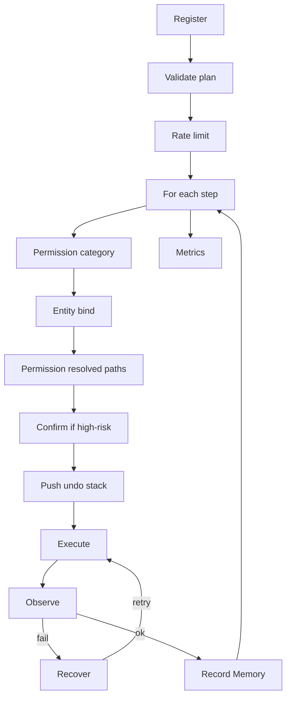

# P8.5 — Universal Desktop Intelligence Foundation

**Status:** Active development — architecture **frozen** (July 2026)  
**Date:** July 2026  
**Audience:** Ripple Core — use this doc to build P8.5  
**Related:** [Architecture Audit](./P8.5-ARCHITECTURE-AUDIT.md) · [Status snapshot](./P8.5-UNIVERSAL-PLANNER.md) · [Original spec](../ripple/new8.5.md)

**Freeze rule:** Do not redesign this document in advance. Change architecture only when coding reveals a real blocker, unnecessary complexity, or a production issue. Phase 0–2 implementation teaches more than another rewrite pass.

---

## 0. Redefinition (read this first)

**P8.5 is not “add more desktop commands on top of the current routers.”**

**P8.5 is the architecture refactor itself.**

**Replace the old P8.5 plan — do not merge with it.** The old plan was becoming another planner on top of routers. This plan **is** the real P8.5: the foundation every future capability plugs into.

Do **not** finish the current partial P8.5 and refactor later. That is **double work**:

```text
If you finish old P8.5 first, you still have to remove later:
  executionPlanToPayload · RippleAction bridge · desktop-fast · desktop-input
  agent-compound · WhatsApp router · LinkedIn router · YouTube router
```

If you start **this** plan now, everything you build afterward stays — no rewrites.

### Old framing (deprecated)

```text
P8.5 Wave 1/2 → ship L0 + GPT → later unify routers
```

### New framing (this plan)

```text
P8.5 = Universal Desktop Intelligence Foundation
  ✓ Universal Planner (single entry — Phase 4+)
  ✓ Entity Resolver
  ✓ Capability Service
  ✓ Execution Context (live state for every tool)
  ✓ Planner Memory (learned app/file bindings — not Knowledge Graph)
  ✓ Executable Tool Registry (metadata + execute)
  ✓ Tool Executor (two-pass permission · confirm · rate limit · undo · execute · observe)
  ✓ Legacy shadow mode → delete routers (Phase 3–4)
  ✓ 20–30 core bridged tools (Phase 1–5)
  ✓ Basic step observation (in executor — not deferred to P9)
```

**P9** then adds browser depth, vision, learning, and open-ended observe/retry/replan — on top of a stable foundation.

### Mindset shift

| Wrong | Right |
|-------|-------|
| “I need another planner” | “I need another **tool**” |
| “I need a WhatsApp router” | “I need `whatsapp.send` in the registry” |
| “Edit orchestrator + bridge + payload” | “Create tool → register → done” |

---

## 1. What we have today vs what P8.5 delivers

| Component | Today | P8.5 target |
|-----------|-------|-------------|
| Entry point | 15+ routers in `commandOrchestrator.ts` | **One** `planUniversalIntent()` front door |
| Tool registry | Declarative manifest only (`toolManifest.json`) | **Executable** registry: metadata + `execute()` |
| Execution | `ExecutionPlan` → `executionPlanToPayload` → `RippleAction[]` | `ToolExecutor.execute(tool, args)` |
| Entity resolution | Scattered: graph, retriever, `nativeAppRegistry` | **`entityResolver.ts`** — apps, files, contacts |
| Capabilities | Ad hoc per planner | **`capabilityService.ts`** — “can Ripple do X?” |
| Observation | P8.5 recovery only; not in executor loop | **Basic observe** per step in Tool Executor |
| Execution state | `WorldModel` snapshot per plan call | **`ExecutionContext`** — shared live state across steps |
| Learned bindings | Knowledge graph only (manual confirm) | **Planner Memory** — auto-learn HRMS → path after success |
| GPT role | Plans + sometimes backend returns actions | **Plans only** — `ExecutionPlan`, never keyboard |
| Tool count | ~15 bridged, 8+ blocked `unbridged_tool` | **20–30 core** in P8.5; path to **100–150** |

See [P8.5-ARCHITECTURE-AUDIT.md](./P8.5-ARCHITECTURE-AUDIT.md) for the full gap analysis.

---

## 2. Target architecture

```text
Speech / typed command
      ↓
transcriptPipeline.ts          (UTF repair, STT fix, normalize)
      ↓
commandOrchestrator.ts       SINGLE ENTRY — safety gates only (rate limit, auth)
      ↓
Intent Parser                intentNormalizer.ts (+ P4 i18n stack — see §11)
      ↓
Universal Planner            plannerPipeline.ts — **L0 first** (cost ladder §11)
      ↓                        L0 includes fast Planner Memory lookup (§9)
      ↓ miss only
Entity Resolver              entityResolver.ts — full resolution
      ↓ miss only
Capability Service           capabilityService.ts + capabilitySnapshotCache.ts
      ↓ miss only
GPT fallback                 gptPlannerBridge.ts
      ↓
ExecutionPlan                flat sequential steps + version stamps (§4a)
      ↓
Plan Validator (final)       planValidator.ts — runs **twice** (§11a): early after L0 + final here
      ↓
ExecutionRequest             planner API boundary (§4b.3) — not raw executor types
      ↓
Execution Context            executionContext.ts
      ↓
Tool Executor                toolExecutor.ts — direct side effects in P8.5; event bus optional (§4b.1, P8.6+)
      ↓
Tool Registry                toolRegistry.ts (thin) + toolLoader / plugins (§4b.2, §4b.7 — later)
      ↓
Native / Adapters            win32Bridge · launchApp · extension adapters
```

**Plan Validator runs twice (not competing designs):** an **early-exit** check after L0 success (§11a stage 4 — fast path out), and a **final** check before Tool Executor regardless of path (L0, cache, or GPT). Same module, two call sites.

```text
Planner Memory               record after successful step (direct call in P8.5; event bus subscriber in P8.6+)
```

### Invariants

1. **No application-specific routers** after Phase 4 — WhatsApp/LinkedIn become **tools**, not `if (isWhatsAppTabActive())` blocks.
2. **Tools never call each other** — only the planner composes; the executor runs steps sequentially.
3. **GPT never touches Windows** — it returns JSON plans only.
4. **Every tool self-describes** — GPT reads manifest metadata, not prompt hacks.
5. **Two-pass permission** — category check before entity bind; **resolved-path check after bind** (P4.6 — filesystem mutators, whatsapp broadcast, multi-target close). Never execute on wildcards without pass 2 (§5).
6. **Shipped safety is mandatory** — P4.5 confirm, P4.6 permission engine, P4.7 undo, ActionLimiter must wire into Tool Executor (§5).
7. **L0 = existing P4 multilingual stack** — do not reimplement; extend `l0Planner.ts` only (§11).
8. **`toolExecutor.ts` is the only module that may call tool `execute()`** — never invoke registered handlers from planners, routers, or adapters directly (§5).
9. **Tool Executor never replans** — bounded recovery only (retry same step / one stale-world replan per §5). Open-ended replan is **P9 only**.
10. **Tool names are immutable** — rename = register new tool + mark old `deprecated` + `replacedBy` (§4).
11. **Tool categories are frozen** — only the eight categories in §4; no ad-hoc `desktop2`, `windows`, etc.
12. **Cost ladder preserved** — L0 runs before full Entity Resolver / Capability Service / GPT (§11). Simple commands like `type hello` must not pay entity-resolution cost.
13. **Planner Memory is single-homed** — lookup only inside L0 fast path and Entity Resolver (§9, §11a). Not a separate top-level pipeline stage that competes with its own wiring.
14. **`requires` ≠ `dependsOnTools`** — category capabilities vs other registered tools (§4a). Do not conflate.
15. **Priority selects tools; cost is telemetry-only** — no dual ranking arbitration (§4a).

---

## 3. Migration phases (0 → 5) — safe, incremental

**Rule:** every phase leaves Ripple in a **working state**. No big-bang rewrite.

### Phase 0 — Scaffold only (no behavior change)

Create empty/skeleton modules. **Do not wire them.** Ripple behaves exactly as today.

| File | Deliverable |
|------|-------------|
| `toolTypes.ts` | `RegisteredTool`, `ToolResult`, `ExecutionContext` types |
| `toolRegistry.ts` | `registerTool`, `getTool`, `executeTool` (stub) |
| `toolExecutor.ts` | `executePlan` skeleton |
| `entityResolver.ts` | `resolveEntities` stub |
| `capabilityService.ts` | `canRipple` stub |
| `capabilitySnapshotCache.ts` | TTL snapshot cache stub |
| `executionContext.ts` | `createExecutionContext`, `refreshContext` stub |
| `plannerMemory.ts` | `lookupBinding`, `recordBinding`, invalidation stub |

**Exit criteria:** `npm run test:p85` green; zero routing changes. **Started:** Phase 0 scaffolds landed (see `electron/agent/planner/tool*.ts`, `*Memory.ts`, `capabilitySnapshotCache.ts`).

---

### Phase 1 — Bridge core desktop tools

Wire **only** these tools to real `execute()` implementations:

```text
desktop.type_text    desktop.press_keys    desktop.copy    desktop.paste
desktop.launch_app   desktop.focus_window  desktop.close_window
desktop.mouse_click  desktop.mouse_move    desktop.mouse_scroll
```

Flow during Phase 1:

```text
Existing planner (unchanged)
      ↓
ExecutionPlan
      ↓
executionPlanToPayload  ← STILL USED as fallback
      ↓
NEW: optional path → Tool Executor → Tools   (feature flag or per-tool)
```

**Exit criteria:** type / copy / paste / open notepad can run via Tool Executor behind a flag; legacy path still default.

---

### Phase 2 — Planner outputs to Tool Executor (no RippleAction)

Change the planner execution path:

```text
Before:  ExecutionPlan → executionPlanToPayload → RippleAction[] → actionRunner
After:   ExecutionPlan → Tool Executor → registry.execute()   (for bridged tools)
```

- Keep `executionPlanToPayload` as shim for **unbridged** tools only.
- `buildExecutorPayload` calls `toolExecutor.executePlan()` when all steps are registered.

**Exit criteria:** all Phase 1 tools execute without `RippleAction` bridge.

---

### Phase 3 — Shadow mode ✅ (in progress)

Run both paths; compare results; **do not switch default yet**.

```text
Old path → result A
New path → result B
logPlannerRouterMismatch / routerParity
shadowParity.ts → comparePlanToLegacyPayload on every P8.5 execute
```

Uses `routerParity.ts`, `logPlannerRouterMismatch`, **`shadowParity.ts`**. Fix mismatches until parity green.

**Exit criteria:** `routerParity.readyForDeprecation` true for desktop typing + launch fixtures (`phase-p85-phase3-shadow.spec.ts`).

---

### Phase 4 — Delete routers 🟡 (started)

Remove (or hard-disable) parallel routers:

```text
WhatsApp early/mention/local    LinkedIn local    YouTube local
desktop-fast    desktop-input-fast    agent-compound
duplicate planDesktopCommand
```

**Phase 4 progress:**
- `executionRequest.ts` — `runExecution` / `runValidatedPlanExecution` API (§4b.3)
- Tool Executor **default on** — opt out with `RIPPLE_P85_TOOL_EXECUTOR=0`
- `legacyRouterGate.ts` — centralized kill switches; desktop-fast/input **shadow-only** by default
- Duplicate shadow-only mismatch logs removed from orchestrator (defer logged in `tryP85FastPath`)
- `desktop-input` silent fallback removed from `tryP85FastPath`
- Recovery replan uses executor when eligible

Replace with planner → tools:

```text
"send this to Noor" → entity resolve → whatsapp.send
```

**Exit criteria:** single orchestrator entry; only safety pre-gates (undo, rate limit) before Universal Planner.

---

### Phase 5 — Add tools forever 🟡 (started)

New capability = register tool. No orchestrator edits.

```text
filesystem.compress → register → done
system.bluetooth    → register → done
```

**Phase 5 progress:**
- `filesystemTools.ts` — delete, create, create_folder, rename, move, open with `execute()`
- `systemTools.ts` — clipboard read/write with `execute()`
- `l0FileOpPlanner.ts` — L0 utterances → `filesystem.*` plan steps
- `desktopPayloadToFilesystem.ts` — NLU file mutators → tools (no payload bridge)
- Manifest v1.2.0 includes wave-2 filesystem tools
- `planValidator` accepts registered executable tools (not payload-bridge only)
- `ensureP85ToolsRegistered()` loads desktop + filesystem + system tools at startup
- **Remaining tracker:** [`P8.5-REMAINING.md`](./P8.5-REMAINING.md) (~58% complete)

Target: 20–30 tools in P8.5; 100–150 over P9+.

---

### Module reference (what each phase builds)

| Module | File | Phase |
|--------|------|-------|
| Tool Registry | `toolRegistry.ts`, `tools/*.ts` | 0 scaffold → 1 execute |
| Tool Executor | `toolExecutor.ts`, `stepObserver.ts` | 0 → 1 → 2 primary |
| Entity Resolver | `entityResolver.ts` | 0 → wire in Phase 2 |
| Capability Service | `capabilityService.ts`, `capabilitySnapshotCache.ts` | 0 → wire Phase 2 |
| Execution Context | `executionContext.ts` | 0 → 1 live in executor |
| Planner Memory | `plannerMemory.ts` | 0 → lookup inside L0 + entityResolver (§11a) |
| Payload bridge | `executionPlanToPayload.ts` | delete in Phase 2–4 |

---

## 4. Tool metadata (required for every tool)

Every tool **must** ship with rich metadata so GPT and L0 can reason without custom prompts.

```json
{
  "name": "gmail.compose",
  "version": "1.0.0",
  "since": "P8.5",
  "deprecated": false,
  "description": "Compose and send email via Gmail extension",
  "category": "communication",
  "wave": 2,
  "requires": ["browser", "communication"],
  "dependsOnTools": ["browser.open"],
  "permissions": ["clipboard"],
  "risk": "medium",
  "cost": 4,
  "priority": 70,
  "idempotent": false,
  "execution": {
    "timeoutMs": 15000,
    "retry": 1,
    "maxExecutionTimeMs": 20000
  },
  "argsSchema": {
    "to": { "type": "string", "required": true },
    "body": { "type": "string", "required": true }
  },
  "examples": [
    "compose an email to Noor saying I'll be late"
  ],
  "preconditions": ["gmail_extension_connected"],
  "observe": "extension:gmail_compose_ack"
}
```

**Field semantics (do not conflate):**

| Field | What it references | Used by | Example |
|-------|-------------------|---------|---------|
| `requires` | **Capability categories** the host must expose | Capability Service, planValidator pass 1 | `["filesystem"]`, `["browser"]` |
| `dependsOnTools` | **Other registered tool names** that must be available / succeed first | Capability Service dependency graph | `["browser.open"]`, `["system.clipboard.read"]` |

`requires` feeds category permission checks (already wired). `dependsOnTools` is the tool dependency graph — Capability Service resolves missing tool deps automatically before execute (§4a).

### ToolDefinition versioning

Every tool carries lifecycle fields so manifest upgrades stay safe:

| Field | Purpose |
|-------|---------|
| `version` | Semver for this tool’s schema/behavior (e.g. `"1.0.0"`) |
| `since` | When the tool was introduced (phase or date, e.g. `"P8.5"`) |
| `deprecated` | If `true`, validator warns; planner prompt marks as legacy |
| `deprecatedSince` | When deprecation started |
| `replacedBy` | Successor tool name (e.g. `"desktop.launch_app_v2"`) |

### Tool names are immutable

Once a tool is registered and any plan may reference it, **`name` never changes**. To rename:

```text
1. Register new tool (e.g. desktop.launch_app_v2)
2. Set old tool deprecated: true, replacedBy: "desktop.launch_app_v2"
3. Keep old tool in registry until plan cache / shadow logs show zero use
4. Never alias-rename in place — cached plans and GPT manifests break silently
```

### Frozen tool categories

Only these eight categories may be used. **PRs adding new category strings are rejected.**

```text
desktop       filesystem    browser       system
memory        communication automation    ai
```

| Legacy (planTypes today) | Maps to |
|--------------------------|---------|
| `apps` | `desktop` |
| `search` | `memory` or `browser` (pick per tool) |

New tools must use frozen names. `toolTypes.ts` exports `FROZEN_TOOL_CATEGORIES` as the runtime allowlist.

Registry manifest global version (`toolManifest.json` `"version"`) bumps when **any** tool changes. Plan cache invalidates on manifest version change (existing behavior).

```ts
export interface ToolDefinition {
  name: string;
  version: string;              // required — per-tool semver
  since?: string;               // e.g. "P8.5", "P9"
  deprecated?: boolean;
  deprecatedSince?: string;
  replacedBy?: string;
  description: string;
  category: ToolCategory;
  wave: 1 | 2;
  /** Capability **categories** — feeds Capability Service category checks. NOT other tool names. */
  requires?: string[];
  /** Other **registered tool names** this tool depends on (tool dependency graph). */
  dependsOnTools?: string[];
  permissions?: string[];
  risk?: "low" | "medium" | "high";
  /** Telemetry / budget only — NOT a planner selection input. See §4a. */
  cost?: number;
  /** Selection tiebreaker when multiple tools solve the same intent. Higher wins. */
  priority?: number;
  /** Max expanded targets per plan (batch cap — §10a). Enforced in planValidator. */
  maxBatch?: number;
  /** State effects for planner sequencing (§4b.15). */
  consumes?: string[];
  produces?: string[];
  changes?: string[];
  /** Sandbox group for future worker isolation (§4b.6). */
  executionGroup?: "native" | "filesystem" | "browser" | "extension" | "ai";
  /** Gates blind transient retry in recoveryEngine (§5). */
  idempotent?: boolean;
  execution?: {
    timeoutMs?: number;
    retry?: number;
    maxExecutionTimeMs?: number;
  };
  argsSchema: Record<string, ToolArgSchema>;
  examples?: string[];
  preconditions?: string[];
  observe?: string;
}
```

See **§4a** for production metadata extensions (timeout, observation confidence, tool health, plan version stamps, rollback contract).

### TypeScript contract

```ts
// planner/toolTypes.ts (new)

export interface ExecutionContext {
  /** Snapshot at plan start — from buildWorldModel() */
  world: WorldModel;
  /** Resolved entities for this utterance */
  resolved: ResolvedEntities;
  /** Capability snapshot from capabilityService */
  capabilities: CapabilitySnapshot;
  /** Live mutable state — updated after each tool step */
  currentApp: string | null;
  focusedWindow: ForegroundWindow | null;
  clipboard: { hasText: boolean; preview: string };
  selection: string | null;
  recentTool: string | null;
  currentFolder: string | null;
  recentFile: string | null;
  lastStepOutput: unknown;
}

export interface ToolContext {
  execution: ExecutionContext;   // tools read this — not raw Windows calls
  command: string;
  stepIndex: number;
}

export interface StepObservation {
  ok: boolean;
  /** 0–1 confidence in observation signal (§4a). Recovery uses this, not boolean alone. */
  confidence?: number;
  reason?: string;
}

export interface ToolRollbackHint {
  /** Confirms or discards the provisional pre-mutate undo push (§4a, §5). */
  rollbackSupported?: boolean;
  rollbackId?: string;
  /** Present when execute succeeded and rollback is finalized; absent on no-op. */
  undoAction?: UndoAction;
}

export interface ToolResult {
  ok: boolean;
  output?: unknown;
  error?: string;
  observation?: StepObservation;
  rollback?: ToolRollbackHint;
}

export interface RegisteredTool {
  definition: ToolDefinition;       // manifest fields + examples
  beforeExecute?: (ctx: ToolContext, args: Record<string, unknown>) => Promise<void | ToolResult>;
  execute: (ctx: ToolContext, args: Record<string, unknown>) => Promise<ToolResult>;
  afterExecute?: (ctx: ToolContext, args: Record<string, unknown>, result: ToolResult) => Promise<ToolResult>;
  rollback?: (ctx: ToolContext, args: Record<string, unknown>, result: ToolResult) => Promise<void>;
  /** @deprecated Use lifecycle hooks + executor safety pipeline (§4b.4) */
  checkPermission?: (ctx: ToolContext, args: Record<string, unknown>) => PermissionResult;
  observeSuccess?: (ctx: ToolContext, args: Record<string, unknown>, before: WorldModel) => Promise<boolean>;
  /** Rewrite args when executing deprecated tool via replacedBy (§4b.12) */
  migrateArgs?: (fromTool: string, oldArgs: Record<string, unknown>) => Record<string, unknown>;
}
```

`toolManifest.json` is **generated** from `RegisteredTool` definitions (`npm run generate:tool-manifest`).

---

## 4a. Production metadata extensions

Cheap additions that harden the foundation before calling P8.5 “production architecture.” Each item below reconciles with existing shipped design — **do not adopt conflicting variants**.

### Summary table

| # | Addition | Status | Reconciliation |
|---|----------|--------|----------------|
| 1 | Tool dependency graph | Add | Use `dependsOnTools` — **not** `dependencies`. Keep `requires` for categories. |
| 2 | Tool `cost` | Add | **Telemetry / budget only** — not planner selection input. |
| 3 | Tool `timeout` / `retry` | Add | Enforced in executor; no conflicts. |
| 4 | Tool `idempotent` | Add | Gates recovery blind-retry (§5). |
| 5 | `ToolResult.rollback` | Add | **Finalizes** provisional pre-mutate undo — not a second undo system. |
| 6 | Observation `confidence` + diff | Add | expected/observed/difference (§4a.6b, §4b.8). |
| 7 | Tool health | Add | **Rolling-window decay** — same pattern as Knowledge Graph §3.10. |
| 8 | Planner Memory TTL | Add | `expiresAfter` (default 90 days) in addition to existence invalidation. |
| 9 | Tool `priority` | Add | **Sole selection tiebreaker** when multiple tools match; cost does not compete. |
| 10 | Plan version stamps | Add | On every `ExecutionPlan`. |
| 11 | Testable pipeline stages | Add | **L0-first** cost ladder preserved (§11a). |
| 12 | Event bus | **P8.6/P9** | §4b.1 — optional; P8.5 uses direct calls in executor. |
| 13 | Registry split + plugins | Add | §4b.2, §4b.7. |
| 14 | ExecutionRequest/Result API | Add | §4b.3. |
| 15 | Failure taxonomy | Add | §5.2. |

### 1. Tool dependency graph (`dependsOnTools`)

Tools never call each other — the **planner** composes steps; the **executor** runs them sequentially. Dependencies describe **capability prerequisites**, not runtime delegation.

```json
"gmail.compose": {
  "requires": ["browser", "communication"],
  "dependsOnTools": ["browser.open", "system.clipboard.read"]
}
```

| Field | Semantics |
|-------|-----------|
| `requires` | Category-level: “host must expose filesystem/browser/…” — checked by Capability Service + validator pass 1 |
| `dependsOnTools` | Tool-level: “these registered tools must be available (and typically appear earlier in the plan)” — checked by Capability Service dependency resolver |

Capability Service (`capabilityService.ts`) walks `dependsOnTools` at plan validation or executor preflight and returns `missing_dependency:browser.open` before execute.

### 2. Cost vs 9. Priority — single ranking rule

**Problem:** Both `cost` and `priority` rank tools — without a rule they conflict (native launch priority 100 / cost 5 vs extension launch priority 30 / cost 1).

**Decision (locked):**

```text
priority  → selects which tool when multiple tools solve the same intent
cost      → telemetry, budget caps, GPT context hints — NOT selection input
```

Example: `desktop.launch_app` (native, priority 100) beats a hypothetical `browser.open_url` launcher (priority 30) even if the browser path has lower cost. Cost appears in metrics and future rate/budget dashboards only.

### 3. Execution timeout policy

Every tool should define:

```ts
execution?: {
  timeoutMs?: number;        // default per category if omitted
  retry?: number;            // executor-level bounded retries (same step)
  maxExecutionTimeMs?: number;
}
```

| Tool | Typical `timeoutMs` |
|------|---------------------|
| `desktop.type_text` | 2000 |
| `browser.navigate` | 15000 |
| `native.ocr` / OCR tools | 30000 |

Executor enforces timeout around `executeToolForExecutor()`; on timeout → observation fail → recovery path (§5).

### 4. Idempotency + recovery

Metadata:

```json
"desktop.copy": { "idempotent": true },
"desktop.type_text": { "idempotent": false },
"filesystem.rename": { "idempotent": false },
"desktop.launch_app": { "idempotent": true }
```

**Recovery rule (required in `recoveryEngine.ts`):**

> `recoveryEngine` may **blind-retry** (transient retry without re-observing state) only when `idempotent === true`. For non-idempotent tools (e.g. `filesystem.rename`) after failure of **unknown** cause, recovery must **observe current state** (file exists? already renamed?) before deciding retry, skip, or hard-fail — because partial application may have occurred before the failure.

Without this sentence, idempotency metadata is inert.

### 5. Step rollback — provisional vs finalized undo

§5 step 5 already pushes `UndoAction` to `undoStack` **before** execute (pre-mutate). Post-execute `ToolResult.rollback` does **not** create a second undo system.

**Contract:**

```text
1. Pre-mutate: undoStack.push(provisional UndoAction) — captures intent + paths
2. Execute
3. Post-execute ToolResult.rollback:
     - rollbackSupported: true + rollbackId → confirms provisional entry (keep on stack)
     - rollbackSupported: false OR no-op execute → discard provisional entry
     - undoAction on result → finalized snapshot for recoveryEngine rollback hints
4. Unhandled exception from execute() (no ToolResult returned): treat as `rollbackSupported: false` — discard provisional undo entry unless the tool's `idempotent` flag is true **and** a subsequent state-check (per §4a.4) confirms partial mutation occurred (keep provisional entry for user undo).
```

Recovery engine uses `rollbackId` to correlate with stack entries; user-facing undo still pops `undoStack` via `desktop.undo`.

### 6. Observation confidence

Extend `StepObservation`:

```ts
{ ok: true, confidence: 0.98 }   // foreground match + title match
{ ok: true, confidence: 0.72 }   // process match, title fuzzy
{ ok: false, confidence: 0.31, reason: "foreground_mismatch" }
```

Recovery thresholds (example): retry if `confidence < 0.5` and tool is idempotent; clarify/hard-fail if non-idempotent and `confidence < 0.7`.

### 6b. Observation model (expected vs observed)

Extend §4a.6 boolean/confidence with structured diff (§4b.8):

```ts
interface StepObservation {
  ok: boolean;
  confidence?: number;
  expected?: Record<string, unknown>;   // e.g. { foreground: "chrome" }
  observed?: Record<string, unknown>;   // e.g. { foreground: "msedge" }
  difference?: string;                  // e.g. "wrong_window"
  reason?: string;
}
```

Recovery uses `difference` for deterministic retry/skip (e.g. `wrong_window` → focus retry if idempotent).

Registry tracks per-tool:

```text
successRate, failureRate, avgRuntimeMs, lastSuccessAt, lastFailureAt
```

**Decay (required):** counters use a **rolling window** — last 50 calls **or** 7 days, whichever comes first — **not lifetime totals**. Same principle as Knowledge Graph recency-weighted scoring (§3.10): a transient network blip must not permanently taint a tool.

Planner may deprioritize unhealthy tools (lower effective priority) but `priority` metadata remains the baseline.

### 8. Planner Memory TTL

In addition to existence invalidation on lookup (§9):

```ts
expiresAfterMs: 90 * 24 * 60 * 60 * 1000  // default 90 days
```

On `lookupBinding`: if `now > validatedAt + expiresAfterMs` → delete row, return MISS. Prevents unbounded growth even when targets still exist.

### 9. Tool priority (selection only)

When multiple registered tools solve the same intent (e.g. launch Chrome via native vs UIA vs shell vs extension):

```json
"desktop.launch_app": { "priority": 100 },
"browser.open_tab": { "priority": 30 }
```

Entity Resolver + planner pick highest `priority` among eligible tools. Cost does not override (see §4a.2).

### 10. ExecutionPlan version stamps

Every plan carries debugging provenance:

```ts
interface ExecutionPlan {
  // ... existing fields ...
  plannerVersion: string;       // e.g. "8.5.0" — PLANNER_VERSION constant
  toolManifestVersion: string;  // TOOL_MANIFEST_VERSION
  worldVersion?: string;        // hash or capturedAt of WorldModel snapshot
}
```

Logged in shadow records, telemetry, and recovery logs.

### 11. ExecutionTransaction (optional, P8.5+)

Lightweight handle for one plan run — useful for shadow diff, telemetry batches, and future rollback boundaries. **Not required for Phase 0–2**; add when shadow mode or tracing needs a single object to pass around.

```ts
interface ExecutionTransaction {
  planId: string;                    // uuid or hash of normalizedUtterance + steps
  plan: ExecutionPlan;
  startedAt: number;
  ctx: ExecutionContext;
  records: StepExecutionRecord[];
  status: "running" | "completed" | "failed" | "cancelled";
}
```

`executePlan()` may return `ToolExecutorSummary` only in P8.5; a thin wrapper can build an `ExecutionTransaction` for logging without changing the executor loop.

---

## 4b. Production engineering extensions

These additions **do not change** the core architecture in §2 — they add engineering structure for scale, debuggability, and plugin growth. **P8.5 ships without most of §4b**; implement incrementally after core desktop tools are green end-to-end.

### 1. Event bus — **P8.6/P9, not required for P8.5**

**P8.5:** `toolExecutor.ts` may call `plannerMemory.record()`, `refreshExecutionContext()`, `undoStack.push()`, etc. directly — keep the loop simple while Phase 0–2 land.

**Later problem:** every new subscriber edits `toolExecutor.ts`.

**P8.6+ fix:** VS Code–style pub/sub (`plannerEventBus.ts`):

```text
Tool Executor
      ↓
emit("tool.success" | "tool.failure" | "step.start" | "plan.complete", payload)

Subscribers (register at startup):
  plannerMemory.on("tool.success", …)
  undoStack.on("tool.success", …)
  planMetrics.on("*", …)
  toolHealth.on("tool.success" | "tool.failure", …)
  executionGraph.on("*", …)
  telemetry.on("*", …)
```

Adding a future system = `subscribe()` — not executor edits. Executor emits; never imports subscriber modules. **Do not block P8.5 on this.**

### 2. Split registry (before 120 tools)

`toolRegistry.ts` stays **thin** — only:

```text
registerTool()
getTool() / getRegisteredTool()
listRegisteredTools()
getManifest()
```

Move to dedicated modules:

| Module | Responsibility |
|--------|----------------|
| `toolLoader.ts` | Load core + plugin tool packs at startup |
| `toolManifestGenerator.ts` | `npm run generate:tool-manifest` |
| `toolDiscovery.ts` | Scan `plugins/` for `registerTools()` exports |
| `toolHealth.ts` | Rolling-window stats (§4a.7) |

### 3. Planner API ≠ Executor API

Planners must not expose internal `ToolExecutorSummary` types. Public boundary:

```ts
interface ExecutionRequest {
  plan: ExecutionPlan;
  command: string;
  world: WorldModel;
  userOverride?: boolean;
}

interface ExecutionResult {
  ok: boolean;
  records: StepExecutionRecord[];
  cancelledByUser?: boolean;
  failure?: FailureKind;  // §5.2
}

runExecution(request: ExecutionRequest): Promise<ExecutionResult>
```

Enables future **cloud executor** or remote worker without changing planner/orchestrator contracts.

### 4. Tool lifecycle hooks

Replace scattered `observeSuccess` / `checkPermission` on registry with explicit hooks:

```ts
interface RegisteredTool {
  definition: ExecutableToolDefinition;
  beforeExecute?(ctx, args): Promise<void | ToolResult>;
  execute(ctx, args): Promise<ToolResult>;
  afterExecute?(ctx, args, result): Promise<ToolResult>;
  rollback?(ctx, args, result): Promise<void>;
}
```

Executor loop: `before → execute → after → observe`; on failure call `rollback` if defined. Permission/confirm stay in executor (security); hooks are tool-specific prep/cleanup.

### 5. Executor step state machine

Each step transitions explicitly (logged + graph-visible):

```text
Pending → Validating → WaitingPermission → WaitingConfirm
       → Executing → Observing → Recovering → Finished | Failed | Cancelled
```

State may be emitted on event bus (`step.stateChange`) when §4b.1 lands. Makes debugging and UI progress easier than implicit sequential code.

### 6. Tool sandboxing (P9 foundation)

Group tools by execution domain — same process in P8.5, isolated workers later:

```text
NativeWorker      desktop.*, system.*
FilesystemWorker  filesystem.*
BrowserWorker     browser.*
ExtensionWorker   communication.* (WhatsApp, Gmail adapters)
AiWorker          ai.* (GPT tool calls — no direct OS)
```

Registry metadata: `executionGroup: "native" | "filesystem" | "browser" | "extension" | "ai"`. P8.5 runs in-process; P9+ can route to worker pools without API change.

### 7. Plugin system

Official layout — no core edits for new integrations:

```text
electron/agent/planner/plugins/
  gmail/
    index.ts          export registerTools(registry)
    gmail.tools.ts
  slack/
  spotify/
```

`toolDiscovery.ts` scans plugins at startup → `registerTools()`. Core ships desktop + filesystem; plugins ship communication/browser extras.

### 8. Observation model (expected / observed / diff)

See §4a.6b. `stepObserver.ts` returns structured diff — recovery reads `difference` not just `ok`.

### 9. Execution graph logging

Produce trace graph per command (not just log lines):

```text
Command → Normalizer → L0 → [Entity → Capability → GPT] → Validator
       → Executor → Tool₁ → Observer → Tool₂ → … → Complete
```

`executionGraph.ts` builds JSON tree from event bus; later visualized in dashboard. Stored in SQLite `execution_traces` (optional persist).

### 10. Background scheduler

Scheduled workflows ("every morning: open HRMS → download → email") **must** call the same `runExecution(ExecutionRequest)` — no second execution path. Scheduler is a plan producer + timer; executor is unchanged.

### 11. ExecutionPlan cache

**Already shipped:** `planCache.ts` caches GPT plans by `(normalizedUtterance, worldKey, manifestVersion)`.

Extend for L0 hits:

```text
"open chrome" → same ExecutionPlan every time → cache hit → skip GPT entirely
```

Key includes `TOOL_MANIFEST_VERSION`. Invalidate on manifest bump or world capability change.

### 12. Tool version migration (`migrateArgs`)

Alongside `deprecated` + `replacedBy`:

```ts
registerTool({
  definition: { name: "desktop.launch_app_v2", … },
  migrateArgs(from: "desktop.launch_app", oldArgs): Record<string, unknown>,
})
```

`planValidator` / executor rewrites old tool names in cached plans before execute. Old plans keep working after tool renames.

### 13. Stage latency metrics

Extend `planMetrics.ts` with per-stage timers:

```text
plannerLatencyMs, normalizerLatencyMs, l0LatencyMs,
entityResolverLatencyMs, capabilityLatencyMs, gptLatencyMs,
validatorLatencyMs, executorLatencyMs, observationLatencyMs, recoveryLatencyMs
```

Enables P95 optimization without guessing bottlenecks.

### 14. Failure taxonomy

See §5.2. All failures use typed `FailureKind` — recovery branches deterministically.

### 15. Tool contracts (produces / consumes / changes)

Every tool declares state effects for smarter planning:

```json
"desktop.copy": {
  "consumes": ["selection"],
  "produces": ["clipboard"],
  "changes": ["clipboard"]
}
```

Planner / validator can reject impossible sequences (paste before copy). Optional in P8.5 Wave 1; required for Wave 2 communication tools.

---

### Tool lifecycle (end-to-end)

One request flows through this pipeline. **Per-step executor detail is in §5** (includes two-pass permission, confirm, undo).

```text
Register          toolRegistry.ts — registerTool() at startup
    ↓
Validate (plan)   planValidator.ts — schema, category permission (pass 1), capability
    ↓
Rate limit        actionLimiter.ts — per plan / per tool (orchestrator or executor entry)
    ↓
For each step:
    Permission (category)     permissionEngine / permissionGate — tool-level only
    Entity bind               entityResolver — expand wildcards → concrete paths
    Permission (resolved)     permissionEngine — P4.6 bulk-delete blocklist on concrete paths
    Safety confirm            executionGuard.confirmIfNeeded — P4.5 dry-run + dialog
    Record undo (pre-mutate)  undoStack.push — P4.7 before destructive filesystem ops
    Execute                   registry.executeTool()
    Observe                   stepObserver.ts
    Recover (bounded)         recoveryEngine.ts
    Record Memory             plannerMemory.ts — on successful entity bind
    ↓
Metrics           planMetrics.ts / planLogger.ts
```



| Stage | Module | Notes |
|-------|--------|-------|
| Validate (plan) | `planValidator.ts` | Pass 1 — tool exists, args schema, category permission |
| Rate limit | `actionLimiter.ts` | `rateLimitForPayload` / per-tool caps — **not deferred** |
| Dependency check | `capabilityService.ts` | `dependsOnTools` + `requires` before execute |
| Permission (category) | `permissionEngine.ts`, `permissionGate.ts` | Before entity bind — tool + utterance policy |
| Entity bind | `entityResolver.ts` | Expand `"all pdfs"` → concrete path list |
| Permission (resolved) | `permissionEngine.ts` | **Pass 2** — block bulk/wildcard deletes (P4.6) |
| Safety confirm | `executionGuard.ts` | `confirmIfNeeded()` — medium/high `risk` metadata |
| Record undo | `undoStack.ts` | Push before mutating ops; `desktop.undo` pops |
| Execute | `toolRegistry.ts` | |
| Observe | `stepObserver.ts` | |
| Recover | `recoveryEngine.ts` | Idempotent-gated blind retry (§4a.4) |
| Record Memory | `plannerMemory.ts` | With invalidation + TTL (§9, §4a.8) |
| Tool health | `toolRegistry.ts` / `toolHealth.ts` | Rolling-window stats (§4a.7) |
| Metrics | `planMetrics.ts` | |

Tools **never skip** Validate or pass-2 permission for filesystem mutators. Metrics **always** run.

---

## 5. Tool Executor pipeline

**Only `toolExecutor.ts` may call `executeToolForExecutor()` from the registry.** Planners, orchestrator, adapters, and tests that need execution must go through `executePlan()` — never import tool handlers directly.

**The executor never open-ended replans.** It may:

- Retry the **same** step (transient failure, bounded)
- Trigger **one** stale-world replan via `recoveryEngine` (existing P8.5j cap)

It may **not** invoke GPT, rebuild multi-step plans, or loop until success — that is **P9 Agent Brain** only.

Replace the flat bridge with a structured loop. **Order matters for security** — see Golden Rule below.

### Per-step loop (canonical)

```text
for each step in plan.steps:

  0. Rate limit check          actionLimiter — if exceeded, abort plan (also at orchestrator entry)
  0b. Dependency check        capabilityService — all dependsOnTools + requires satisfied

  1. Permission pass 1         category / tool-level only (permissionEngine, permissionGate)
                               — e.g. "is filesystem.delete allowed for this user/session?"
                               — does NOT evaluate wildcard targets yet

  2. Entity bind               entityResolver.bindStepArgs(step, ctx)
                               — expand "all pdfs", "Downloads", "HRMS" → concrete paths/exes

  3. Permission pass 2         permissionEngine on RESOLVED args (required for mutators)
                               — P4.6 bulk-delete blocklist on concrete path list
                               — blocks delete_file when target set matches wildcard/bulk rules
                               — if pass 1 allowed but pass 2 blocks → fail step, do not execute

  4. Safety confirm            executionGuard.confirmIfNeeded(tool, resolvedArgs, ctx)
                               — P4.5: dry-run preview + confirm dialog for medium/high risk
                               — reads tool.metadata.risk + existing CONFIRM_KINDS
                               — user deny → **abort entire plan** (not just current step):
                                 mark step cancelled, skip remaining steps, return partial
                                 ExecutionResult with `cancelledByUser: true` (§5.1)

  5. Record undo (pre-mutate)  undoStack.push(provisional UndoAction) for filesystem mutators
                               — P4.7: before delete/move/rename/create executes
                               — finalized or discarded post-execute via ToolResult.rollback (§4a.5)

  6. Execute                   registry.executeTool(tool, ctx, resolvedArgs)
                               — enforce tool.execution.timeoutMs (§4a.3)

  7. Observe                   stepObserver — ok + confidence 0–1 (§4a.6)

  8. Recover (bounded)         recoveryEngine — transient | stale replan | hard fail
                               — blind retry ONLY if idempotent: true (§4a.4)
                               — non-idempotent: observe state before retry decision

  9. Record Memory             plannerMemory.recordBinding — only if confidence ≥ 0.9
                               AND user did not manually override (disambiguation pick)

 10. Refresh Execution Context refreshContext(ctx) — next step reads updated state
```

### Golden Rule (P4.6 — do not regress)

```text
❌ WRONG:  Permission(check wildcards) → Entity bind → Execute
           "delete all pdfs" passes policy before paths exist → bulk-delete hole

✅ RIGHT:  Permission(category) → Entity bind → Permission(resolved paths) → Confirm → Execute
```

`planValidator.ts` may run **pass 1** at plan level (whole plan + utterance).  
`toolExecutor.ts` **must** run **pass 2** after entity bind for:

**Named mutators (always pass 2):**

- `filesystem.delete`, `filesystem.move`, `filesystem.rename`, `filesystem.create`
- `communication.whatsapp.send` — resolved recipient list (blocks broadcast / wildcard "everyone")
- `desktop.close_window` / `desktop.close_app` — when resolved args expand to **multiple** window targets (blocks "close all Chrome")

**General rule (catch-all):**

- Any step where args contain globs, collections, or retriever-expanded lists after entity bind

Pass 2 is **not** filesystem-only — P4.6 bulk/broadcast blocklist applies wherever resolved targets exist.

### §5.1 Confirm-deny scope (locked)

When the user clicks **Cancel** on a P4.5 confirm dialog mid-plan:

```text
1. Current step → status: cancelled (not failed — logged as safety_cancel)
2. Remaining steps → skipped (not executed)
3. Executor returns partial ExecutionResult — earlier successful steps are NOT rolled back automatically
4. User may invoke desktop.undo for filesystem steps that pushed provisional undo entries
```

Do not continue the plan after confirm deny — partial execution with skipped tail is intentional.

### §5.2 Failure taxonomy (standardized)

Replace free-form `error` strings with typed failures (§4b.14). RecoveryEngine branches on type:

| Type | Example | Recovery |
|------|---------|----------|
| `ValidationFailure` | missing_arg, unknown_tool | hard-fail step |
| `PermissionFailure` | permission_blocked, pass-2 block | hard-fail step |
| `DependencyFailure` | missing_dependency:browser.open | hard-fail step |
| `CapabilityFailure` | extension offline | clarify or defer |
| `TimeoutFailure` | tool exceeded timeoutMs | transient retry if idempotent |
| `ExecutionFailure` | OS error from execute() | observe + idempotent gate |
| `ObservationFailure` | wrong_window, path_missing | bounded retry / stale replan |

Emit via event bus (`tool.failure`, `tool.success`) — §4b.1.

Reuse existing modules — do not reimplement:

| Feature | Module | Shipped |
|---------|--------|---------|
| Permission pass 1 & 2 | `automation/safety/permissionEngine.ts`, `permissionGate.ts` | P4.6 |
| Confirm dialog | `automation/safety/executionGuard.ts` → `confirmIfNeeded()` | P4.5 |
| Undo stack | `automation/safety/undoStack.ts` | P4.7 |
| Rate limiting | `automation/safety/actionLimiter.ts` → `rateLimitForPayload`, `recordActionUse` | P4+ |

**Wire in Phase 1–2** when bridging filesystem tools. Typing-only tools skip pass 2, confirm, and undo push.

### Observation in P8.5 (not deferred to P9)

Basic checks **per step** — enough for “Open Chrome → did Chrome open?”:

| Tool category | Observe signal |
|---------------|----------------|
| `desktop.launch_app` | Foreground process/title matches target |
| `desktop.type_text` | Existing `observe.ts` / clipboard probe |
| `desktop.press_keys` | Navigation keys: relaxed verify (already in P7 polish) |
| `filesystem.*` | Path exists / operation result |
| `browser.*` | Tab URL / extension ack (adapter-specific) |

Full open-ended **replan loop** (P9) builds on this hook — but the hook ships in P8.5.

Files to extend:

- `planner/toolExecutor.ts` (new)
- `planner/stepObserver.ts` (new — thin wrapper over `observe.ts`)
- `planner/recoveryEngine.ts` (existing — wire into executor loop)

---

## 6. Entity Resolver

**File:** `electron/agent/planner/entityResolver.ts`

Unifies today’s scattered resolution:

```text
resolveEntities(utterance, world) → {
  apps:     retrieveAppCandidates + nativeAppRegistry + graph
  files:    retriever chain (capability_cache → graph → alias → search → index → disk)
  contacts: knowledge graph + adapter memory
  folders:  well-known folders + user aliases
}
```

### Resolution order (apps — e.g. “HRMS”)

```text
1. Knowledge graph alias (user-confirmed)
2. Capability cache (recent successful open)
3. nativeAppRegistry (builtins + Start Menu scan)
4. Fuzzy match on discovered_apps.json
5. Defer to clarification — NOT blind GPT guess
```

The planner receives **resolved or candidate lists**, not raw strings.

---

## 7. Capability Service + Capability Snapshot Cache

**Files:**

- `electron/agent/planner/capabilityService.ts` — answers “can Ripple do X?”
- `electron/agent/planner/capabilitySnapshotCache.ts` — TTL cache for capability **snapshots**

**Naming (fixed — no collision):**

| Module | Path | Purpose |
|--------|------|---------|
| Capability snapshot cache | `planner/capabilitySnapshotCache.ts` | Extension/native/permission probes (P8.5) |
| File-path capability cache | `storage/capabilityCache.ts` | Recent successful file opens (P5) — **different module** |

Never name both `capabilityCache.ts`.

### Why cache?

Checking on **every command** is expensive:

- Start Menu / installed apps scan
- Extension connectivity (WhatsApp, Gmail, CDP)
- Native sidecar feature flags (OCR, UIA)
- Permission grants per category

Capability Service **reads from cache first**, refreshes on TTL or invalidation.

### Capability snapshot (cached)

```ts
interface CapabilitySnapshot {
  capturedAt: number;
  manifestVersion: string;
  registeredTools: string[];
  native: { sendInput: boolean; uia: boolean; ocr: boolean; sidecarUp: boolean };
  extensions: { whatsapp: boolean; gmail: boolean; /* … */ };
  permissions: Record<string, "granted" | "denied" | "unknown">;
  installedAppsCount?: number;   // not full list — count + stale flag
}
```

### Cache policy

| Data | Default TTL | Invalidate when |
|------|-------------|-----------------|
| Extension connectivity | 30s | extension reconnect/disconnect event |
| Native sidecar caps | 60s | sidecar auth change |
| Permission grants | 5 min | user changes settings |
| Installed apps summary | 10 min | app install/uninstall, manual refresh |
| Full tool registry list | Until manifest version changes | any `registerTool` / deploy |

```text
getCapabilities()
    ↓
capabilitySnapshotCache hit? → return snapshot
    ↓ miss
probe extensions + native + permissions (+ optional app scan)
    ↓
store in capabilitySnapshotCache → return
```

### Queries at plan time

```text
canRipple("send_whatsapp")  → extensions.whatsapp && permission.messaging
canRipple("rename_file")    → tool registered && permissions.filesystem
canRipple("ocr")            → native.ocr
canRipple("bluetooth")      → false until system.bluetooth registered
```

Injected into:

- World model / LLM context (trimmed snapshot)
- Plan validator (reject unavailable tools)
- Clarification (“I can’t control Bluetooth yet”)
- Entity resolver (don’t search for apps when launch tool unavailable)

---

## 8. Execution Context

**File:** `electron/agent/planner/executionContext.ts`

**Purpose:** one live object every tool reads during a plan run — avoids each tool re-querying Windows.

Created at plan start from `buildWorldModel()`. **Refreshed** after each tool step (foreground, clipboard, selection).

| Field | Source | Updated when |
|-------|--------|--------------|
| `currentApp` / `focusedWindow` | win32Bridge foreground | After launch, focus, close |
| `clipboard` | clipboardService | After copy, paste, cut |
| `selection` | UIA / adapter | After select_all, copy |
| `recentTool` | executor | After each step |
| `currentFolder` | Explorer context / last filesystem tool | After filesystem ops |
| `recentFile` | last open/move/rename | After filesystem ops |
| `lastStepOutput` | prior `ToolResult.output` | After each step |

```text
Planner → ExecutionPlan
      ↓
createExecutionContext(world, resolved, capabilities)
      ↓
Tool Executor (each step reads ctx.execution, then refreshContext())
```

**Not the same as World Model:** World Model is the planner’s read-only snapshot. Execution Context is **mutable runtime state** for the executor loop.

---

## 9. Three memory systems (do not mix)

Ripple has **three separate memory layers**. Future developers must not conflate them.

```text
Planner Memory     ≠     Knowledge Graph     ≠     Long-term Memory
   (P8.5)                  (P8)                    (P8 / P11)
```

| | **Planner Memory** | **Knowledge Graph** | **Long-term Memory** |
|---|-------------------|---------------------|----------------------|
| **Module** | `plannerMemory.ts` | `knowledgeGraph.ts` | P8 retriever / semantic index; P11 personalization |
| **Purpose** | Fast re-open for planner | User-curated entity graph | Episodic history, preferences, semantic search |
| **Who writes** | Tool Executor on **success** | User confirm, disambiguation, bootstrap | Conversation turns, file touches, activity |
| **Who reads** | Entity Resolver, L0 **first** | Entity Resolver, retriever | Retriever, GPT context, “what did I open yesterday” |
| **Lifetime** | Until invalidated or promoted | Persistent user data | Persistent + semantic |
| **Example** | “HRMS” → exe after one successful launch | User confirms “HRMS = Workday” in overlay | “You opened invoice.pdf last Tuesday” |
| **GPT needed?** | No on hit | No on hit | Sometimes for semantic queries |

### Decision tree for developers

```text
Need instant re-open of something the planner just learned?
  → Planner Memory

Need user-confirmed alias or file relationship?
  → Knowledge Graph

Need conversational history or semantic “remember when…”?
  → Long-term Memory (P8/P11) — NOT plannerMemory.ts
```

### Planner Memory detail

**File:** `electron/agent/planner/plannerMemory.ts`

**Purpose:** auto-learn **successful entity bindings** only — phrase → concrete target for the planner.

```text
User: "Open HRMS"
      ↓
Planner Memory miss → Entity Resolver → launch succeeds (plan confidence ≥ 0.9)
      ↓
recordBinding({ phrase: "hrms", kind: "app", target: path, confidence: 0.95 })
      ↓  (skipped if confidence < 0.9 OR user picked from disambiguation overlay)
Next time: lookupBinding("hrms") → L0/resolver — no Start Menu scan, no GPT
```

### Record threshold

| Condition | Record to Planner Memory? |
|-----------|---------------------------|
| Step succeeded + plan/step confidence **≥ 0.9** | Yes |
| Confidence **< 0.9** | No — too noisy |
| User **manually overrode** (disambiguation, clarify pick) | No — Knowledge Graph owns confirmed aliases |
| User confirmed in overlay | Use Knowledge Graph, not planner memory |

Constant: `PLANNER_MEMORY_RECORD_MIN_CONFIDENCE = 0.9` in `plannerMemory.ts`.

**TTL (required — §4a.8):** every binding also carries `expiresAt` (default **90 days** from `validatedAt`). On lookup, if expired → delete row and return MISS — even when the target still exists on disk. Prevents unbounded growth independent of existence checks.

```ts
PLANNER_MEMORY_DEFAULT_TTL_MS = 90 * 24 * 60 * 60 * 1000;
```

Storage: SQLite `planner_memory` (phrase, kind, target, confidence, last_used_at, validated_at, expires_at).

**Optional promotion:** high-confidence planner bindings may be offered to Knowledge Graph — still separate stores.

### Planner Memory invalidation (required)

Auto-recorded bindings at `confidence: 1.0` **must not** fail silently when targets go stale.

**On lookup** (`lookupBinding(phrase)`):

```text
1. Read row from planner_memory
2. Existence check:
     app  → target exe/shortcut exists OR app still in Start Menu scan
     file → path exists on disk
3. If missing → delete row (or mark invalid), return MISS → fall through to Entity Resolver
4. If hit → update last_used_at, return binding
```

**Invalidate when:**

| Event | Action |
|-------|--------|
| Lookup existence check fails | Delete binding |
| User corrects via disambiguation | Replace or delete conflicting binding |
| App uninstall detected (capability scan) | Delete app bindings for that appId |
| Manual "forget" command (future) | Delete by phrase |

**Never** skip existence check because `confidence === 1.0`. Stale high-confidence bindings are worse than a cache miss.

Wire into: `entityResolver` (lookup **before** graph, with validation + TTL), `l0Planner` (fast memory lookup inside L0 — **single home**, see §11a), `toolExecutor` (record after success), `capabilityService` (app uninstall invalidation hook).

**Not a standalone pipeline stage:** Planner Memory lookup is invoked from L0 and Entity Resolver only — never as a separate top-level stage that runs before L0 for every utterance.

---

## 10. Tool catalog — P8.5 vs later

### P8.5 core (20–30 tools) — ship first

**Desktop (15)**

```text
desktop.launch_app          desktop.focus_window       desktop.close_window
desktop.type_text           desktop.press_keys         desktop.copy
desktop.paste               desktop.cut                desktop.select_all
desktop.mouse_click         desktop.mouse_move         desktop.mouse_scroll
desktop.undo                desktop.redo               (optional: desktop.switch_window)
```

**Filesystem (8)**

```text
filesystem.search           filesystem.open            filesystem.copy
filesystem.move             filesystem.rename          filesystem.delete
filesystem.create_folder    filesystem.list_directory
```

**Memory (2)**

```text
memory.search               memory.store
```

**Communication (2)** — as tools, not routers

```text
whatsapp.send               gmail.compose
```

**System (3)**

```text
system.clipboard.read       system.clipboard.write     system.lock
```

### P9+ expansion (path to 100–150)

```text
browser.*  window.*  calendar.*  email.*  contacts.*
excel.*  word.*  powerpoint.*  pdf.*  terminal.*
network.*  wifi.*  bluetooth.*  printer.*  camera.*
ocr.*  vision.*  ai.*  automation.*
filesystem.compress  filesystem.extract  …
```

Architecture supports 150 tools **if** the executor and metadata are solid. P8.5 proves the pattern with ~25.

---

## 10a. ExecutionPlan scope (P8.5 boundary)

`ExecutionPlan.steps` is a **flat, sequential** array. No branching, loops, or `foreach` in P8.5.

| Supported in P8.5 | Out of scope (P9+) |
|-------------------|---------------------|
| Fixed multi-step: "open Chrome, type hello" | "Close **all** Chrome windows" (variable count) |
| GPT emits N known steps upfront | "Rename **every** screenshot in Downloads" |
| L0 compound (fixed steps from regex) | "For each unread email, mark read" |
| Linear tool chain via executor | Dynamic replan when step count unknown |

**Why:** variable-length target sets require observe → expand → replan loop (P9 agent brain). GPT **unrolling** a guessed fixed plan (e.g. exactly 5 delete steps) breaks when reality differs.

**P8.5 behavior for variable commands:**

1. **Entity Resolver** expands utterance targets → concrete list (one step per file/path)
2. **planValidator.ts** enforces batch cap **before** executor — if expanded step count > tool metadata `maxBatch` (default 10 for `filesystem.delete`) → clarify or reject plan (do not silently truncate)
3. If utterance implies unbounded set and resolver cannot bound → **clarify** or defer to P9

**Batch-cap ownership (locked):** expansion happens in `entityResolver.ts`; cap enforcement happens in `planValidator.ts` using tool metadata (`maxBatch`, default 10 for `filesystem.delete`). Executor assumes plan is already within cap.

Examples in §17 are **linear** by design. Multi-app chains need each tool registered; variable iteration needs P9.

---

## 11. GPT’s role + L0 / P4 multilingual fast-path

### L0 is the existing P4 stack — do not reimplement

**L0 ≠ a new normalizer.** During router deletion (Phase 4), preserve:

```text
transcriptPipeline.ts
    repairCorruptedTranscript · correctWhisperMishearings · normalizeTranscript
    ↓
preprocessForNlu()  — automation/voice/nlu/preprocess.ts
    normalizeHinglish · normalizeHinglishSlots · normalizeUrdu · normalizeUrduRoman
    ↓
intentNormalizer.ts  — P8.5 strip filler (extends, does not replace)
    ↓
l0Planner.ts + parseDesktopInputFallback + parseNativeCommandStrict
```

| Layer | Files | Status |
|-------|-------|--------|
| P4 multilingual | `hinglishNormalize.ts`, `hinglishSlots.ts`, `urduNormalize.ts`, `preprocess.ts` | **Shipped — 418-case matrix** |
| Desktop regex | `parseDesktopInput.ts`, `l0Planner.ts`, `l0CompoundPlanner.ts` | **Shipped** |
| P8.5 normalizer | `intentNormalizer.ts` | Thin filler strip on top |

**Phase 4 rule:** delete **routers**, not **normalizers**. `commandOrchestrator` early exits for WA/LinkedIn go away; `preprocessForNlu` and L0 regex paths stay.

### GPT role (minimal) — cost ladder

```text
User utterance
      ↓
Normalizer (intentNormalizer + P4 preprocess)
      ↓
L0 rules (+ fast Planner Memory lookup inside L0)  → 70%+ of simple commands
      ↓ miss only
Entity Resolver (full)     → grounded open (“open Resume.pdf”)
      ↓ miss only
Capability Resolver        → trim manifest to capability-eligible tools **before GPT sees them**
      ↓ miss only
GPT                        → multi-step / ambiguous only (chooses from trimmed manifest)
      ↓
Plan Validator (final)     → schema, pass-1 permission, confidence gate, batch cap (§10a)
      ↓
ExecutionPlan (+ plannerVersion, toolManifestVersion, worldVersion)
      ↓
Tool Executor                → never GPT again for this request
```

**Do not reorder:** Entity Resolver and Capability Service run **after L0 miss only**. Running them before L0 for every utterance (including `type hello`) reverses the cost ladder and violates P95 latency targets.

GPT input: normalized utterance + world + **tool manifest with examples** + resolved entity hints.  
GPT output: `ExecutionPlan` only — `steps[].tool` must exist in registry.

### §11a Formal planner pipeline (independently testable stages)

**Goal:** each stage is unit-testable in isolation (`plannerPipelineStages.ts` or equivalent).

**Order (locked — preserves cost ladder):**

```text
Stage 1  Intent          raw command string
Stage 2  Normalizer      intentNormalizer + P4 preprocess → normalized utterance
Stage 3  L0              l0Planner + l0CompoundPlanner
           └─ includes Planner Memory fast lookup (lookupBinding before graph scan)
Stage 4  Plan Validator (early)  fast exit if L0 produced valid execute plan
         ─── L0 miss boundary ───
Stage 5  Entity Resolver full   resolveEntities + bind candidates + batch expansion
Stage 6  Capability Resolver    filterToolManifest() — trim to capability-eligible tools
                                 before GPT prompt (NOT validating GPT output — GPT hasn't run yet)
Stage 7  GPT fallback            gptPlannerBridge (last resort; sees filtered manifest)
Stage 8  Plan Validator (final)  schema, pass-1 permission, confidence gate, maxBatch cap
Stage 9  ExecutionPlan output    + version stamps (§4a.10)
```

**Plan Validator runs twice:** stage 4 (early exit on L0 hit) and stage 8 (final gate for all paths). Same `validatePlan()` — two call sites.

**Capability Resolver — two related checks (not duplicate logic):**

| When | Function | Purpose |
|------|----------|---------|
| Planner stage 6 | `capabilityService.filterToolManifest(manifest, snapshot)` | Trim GPT candidate list |
| Executor step 0b | `capabilityService.checkToolDependencies(tool, snapshot)` | Per-step preflight before execute |

Both read the same `CapabilitySnapshot`; different surfaces — manifest filter vs single-tool gate.

```text
❌ WRONG (reverses cost ladder):
Normalizer → Entity Resolver → Capability → Planner Memory → L0 → GPT

✅ RIGHT:
Normalizer → L0 (incl. Planner Memory) → [miss] → Entity Resolver → Capability → GPT → Validator
```

Each stage exports `{ stage, ok, output?, deferReason? }` for tests. `runPlannerPipeline` / `runPlannerPipelineAsync` orchestrates stages without changing execution order.

**Planner Memory call sites (single rule):**

| Call site | When |
|-----------|------|
| Inside L0 (`l0Planner.ts`) | Fast phrase→target before regex / native parse |
| Inside Entity Resolver | Before graph/retriever for app/file opens |
| After successful step (P8.5) | Direct `recordBinding()` from executor — e.g. launch_app success |
| Event bus subscriber (P8.6+) | `plannerMemory.on("tool.success")` replaces direct call (§4b.1) |

No third top-level “Planner Memory stage” in the orchestrator.

---

## 12. Commit discipline (every commit moves the architecture)

**Warning:** do not let this doc sit unimplemented. Each commit = one step; Ripple stays working.

| # | Commit target | Phase |
|---|---------------|-------|
| 1 | `toolTypes.ts` + `toolRegistry.ts` scaffold | 0 |
| 2 | `toolExecutor.ts` + `executionContext.ts` scaffold | 0 |
| 3 | `entityResolver.ts` scaffold | 0 |
| 4 | `capabilityService.ts` + `capabilitySnapshotCache.ts` scaffold | 0 |
| 5 | `plannerMemory.ts` scaffold | 0 |
| 6 | Bridge `desktop.type_text` execute() | 1 |
| 7 | Bridge `desktop.copy` / `paste` / `press_keys` | 1 |
| 8 | Bridge `desktop.launch_app` + focus + close | 1 |
| 9 | Bridge mouse tools | 1 |
| 10 | Wire Phase 1 tools through executor (flagged) | 1 |
| 11 | Wire P4.5 confirm + P4.6 pass-2 permission + P4.7 undo + ActionLimiter in executor | 2 |
| 12 | `buildExecutorPayload` → `toolExecutor` for bridged plans | 2 |
| 13 | Wire entity resolver + capability service into pipeline | 2 |
| 14 | Wire planner memory lookup + record | 2 |
| 15 | Shadow mode parity fixes | 3 |
| 16 | Production metadata: `dependsOnTools`, timeout, idempotent, priority, cost | 2–3 |
| 17 | Observation confidence + ToolResult.rollback contract | 2–3 |
| 18 | Planner Memory TTL + tool health rolling window | 2–3 |
| 19 | ExecutionPlan version stamps + `plannerPipelineStages.ts` | 2–3 |
| 20 | Remove `executionPlanToPayload` for core tools | 2–4 |
| 21 | Delete legacy router (one at a time) | 4 |
| 22 | Register `filesystem.*` tools | 5 |
| 23 | Event bus + execution graph logging | **P8.6+** (after Phase 3 shadow green) |
| 24 | ExecutionRequest/Result API boundary | 3–4 |
| 25 | Split registry + plugin discovery scaffold | 4–5 |
| 26 | Executor state machine + failure taxonomy | 3–4 |
| 27 | Stage latency metrics + tool contracts metadata | 4–5 |

Optional pace guide (same phases):

| Week | Phases | Focus |
|------|--------|-------|
| Week 1 | 0 + 1 | Scaffolds + bridge desktop tools |
| Week 2 | 2 + 3 | Executor primary path + shadow parity |
| Week 3 | 4 + 5 | Router removal + expand tool catalog |

### Kill switches (keep until Phase 4 complete)

| Env | Effect |
|-----|--------|
| `RIPPLE_P85_KILL=1` | Legacy routers execute |
| `RIPPLE_P85_SHADOW=1` | Log planner vs legacy mismatch |
| `RIPPLE_P85_SHADOW_COMPARE=1` | On P8.5 execute, compare plan to legacy payload (Phase 3) |
| `RIPPLE_P85_LEGACY_*` | Per-router fallback |
| `RIPPLE_P85_TOOL_EXECUTOR=0` | Disable Tool Executor (legacy payload path) |
| `RIPPLE_P85_TOOL_EXECUTOR=1` | Force Tool Executor on |

---

## 13. What NOT to build in P8.5

Hold these until foundation is done — otherwise you repeat the “feature on feature” mistake:

- OCR / vision loops
- Excel / Word / PowerPoint automation
- Bluetooth / printer / camera tools
- Full browser automation suite
- P9 open-ended replan agent

**Planner Memory is in P8.5** — distinct from Knowledge Graph and Long-term Memory (see §9).

---

## 14. P9 scope (after P8.5 foundation)

```text
P9
  Browser tools (search, navigate, click, extract)
  Full observe → retry → replan loop
  Vision / OCR in world model
  Memory learning from outcomes
  ai.summarize / ai.translate as planner tools
  50–100 additional tools
```

P9 assumes P8.5’s executor hook exists — do not duplicate planning paths.

---

## 15. Success criteria (definition of done)

### Architecture (Phase 4 complete)

- [ ] Phase 0 scaffolds merged; tests green throughout
- [ ] Phase 1–2: executor runs **two-pass permission** for filesystem mutators (P4.6)
- [ ] `confirmIfNeeded` wired for medium/high risk tools (P4.5)
- [ ] `undoStack.push` before mutating ops; undo voice path still works (P4.7)
- [ ] `actionLimiter` at orchestrator + executor entry — not skipped
- [ ] Planner memory invalidates stale bindings on lookup **and** TTL expiry (§4a.8)
- [ ] L0 still uses P4 `preprocessForNlu` — multilingual tests green
- [ ] L0 runs before full Entity Resolver — cost ladder preserved (§11a)
- [ ] `dependsOnTools` distinct from `requires`; Capability Service checks both
- [ ] `priority` selects tools; `cost` is metrics-only (§4a.2)
- [ ] Recovery blind-retry gated by `idempotent: true` (§4a.4)
- [ ] Pre-mutate undo finalized via `ToolResult.rollback` — no duplicate undo paths (§4a.5)
- [ ] Tool health uses rolling window decay — not lifetime counters (§4a.7)
- [ ] Pass-2 permission covers filesystem + whatsapp.send + multi-target close (§5)
- [ ] Confirm deny aborts entire plan — partial result returned (§5.1)
- [ ] Batch cap enforced in planValidator after entityResolver expansion (§10a)
- [ ] Plan Validator runs twice — early (L0) + final (§11a)
- [ ] Capability stage 6 filters manifest pre-GPT; executor 0b checks per-step deps
- [ ] Event bus decouples executor subscribers — **P8.6+**; P8.5 direct calls OK (§4b.1)
- [ ] ExecutionRequest/Result API — planners don't import executor internals (§4b.3)
- [ ] Failure taxonomy typed — recovery branches on FailureKind (§5.2)
- [ ] ExecutionPlan cache hits for repeated L0 utterances (§4b.11)
- [ ] Stage latency metrics per pipeline segment (§4b.13)
- [ ] ExecutionPlan carries plannerVersion + toolManifestVersion
- [ ] ExecutionPlan variable-set commands clarify or cap — not silent truncate (§10a)
- [ ] Phase 3: shadow parity green (`routerParity.readyForDeprecation`)
- [ ] Phase 4: single orchestrator entry; legacy routers deleted
- [ ] `executionContext` refreshed per step; tools use ctx not ad hoc Windows calls
- [ ] `plannerMemory` lookup inside L0 + entityResolver only (§11a) — not a standalone stage
- [ ] `entityResolver` + `capabilityService` in pipeline
- [ ] Per-step observation for launch + type
- [ ] `unbridged_tool` only for not-yet-implemented tools

### Quality

- [ ] `npm run test:p85` green; +30 executor integration tests
- [ ] Ten phrasings → identical tool plan (type/copy/open)
- [ ] “Open Notepad, type hello” multi-step via executor
- [ ] Router mismatch rate → 0 in dev before router deletion

### Developer experience

- [ ] New tool = 1 file in `tools/` + register call — no orchestrator edit
- [ ] Manifest auto-generated with examples
- [ ] Architecture audit gaps §4–§6 closed

---

## 16. File map (target)

```text
electron/agent/planner/
  toolTypes.ts              NEW — RegisteredTool, ToolResult, metadata (§4a–§4b)
  toolRegistry.ts           THIN — register/get/list/manifest only (§4b.2)
  toolLoader.ts             NEW — core + plugin load
  toolManifestGenerator.ts  NEW — generate:tool-manifest
  toolDiscovery.ts          NEW — scan plugins/
  toolHealth.ts             NEW — rolling-window stats (§4a.7)
  plannerEventBus.ts        NEW — pub/sub (§4b.1)
  executionGraph.ts         NEW — trace graph from events (§4b.9)
  executionApi.ts           NEW — ExecutionRequest / ExecutionResult (§4b.3)
  plannerPipelineStages.ts  NEW — testable stage functions (§11a)
  capabilityService.ts      NEW — filterToolManifest + checkToolDependencies
  capabilitySnapshotCache.ts NEW — TTL snapshots (NOT storage/capabilityCache.ts)
  executionContext.ts       NEW — live state per plan run
  plannerMemory.ts          NEW — learned bindings + TTL (§4a.8)
  stepObserver.ts           NEW — expected/observed/diff (§4a.6b)
  entityResolver.ts         NEW — full resolution + batch expansion (§10a)
  planCache.ts              EXISTING — ExecutionPlan cache (§4b.11)
  plugins/                  NEW — gmail/, slack/, … registerTools() (§4b.7)
  tools/
    desktopTools.ts         NEW — execute bindings + metadata
    filesystem.tools.ts     NEW
  plannerPipeline.ts        EXISTING — orchestrates §11a stages
  planValidator.ts          EXISTING — early + final validation, maxBatch cap
  recoveryEngine.ts         EXISTING — idempotent-gated retry + FailureKind (§5.2)
  toolExecutor.ts           NEW — state machine + event emit (§4b.5)
  executionPlanToPayload.ts SHIM — delete when migration complete
  toolDefinitions.ts        MERGE into toolRegistry or keep as schema export
  toolManifest.json         GENERATED

electron/services/
  commandOrchestrator.ts    REWRITE routing — single entry
  scheduler.ts              NEW (P9) — uses same executionApi (§4b.10)

electron/automation/
  actionRunner.ts           KEEP — called by tool execute() for compat during migration
```

---

## 17. Example flows (target behavior)

### “Open Chrome”

```text
L0 → desktop.launch_app { app: "chrome" }
Executor → permission ok → launch → observe foreground chrome → success
```

### “Compress Downloads folder”

```text
L0 miss → entity resolve Downloads → GPT or grounded
Plan → filesystem.compress { path: "C:\Users\...\Downloads" }
Executor → native zip API → observe archive exists
```

### “Open Chrome, search React, open first result, summarize, send WhatsApp”

```text
P8.5: planner produces multi-step plan (GPT)
P9: browser.open_first_result, page.summarize, whatsapp.send — tools must exist
Executor: step loop with observe between each
```

Multi-app chains work **only** when each tool exists and observation is wired — plan the tool list before promising the workflow.

---

## 18. Roadmap summary

```text
P8.5 (this plan) — REPLACE old P8.5, do not merge
────────────────────────────────────────
  Phase 0: Scaffolds (no behavior change)
  Phase 1: Bridge desktop tools
  Phase 2: Planner → Tool Executor (no RippleAction)
  Phase 3: Shadow parity
  Phase 4: Delete routers · single entry
  Phase 5: Add tools forever (20–30 → 100–150)

  Modules: Universal Planner · Entity Resolver · Capability Service
           Execution Context · Planner Memory · Tool Registry · Tool Executor
  Deferred P8.6+: Event Bus · Execution Graph · Plugin Discovery

P9
────────────────────────────────────────
  Browser · Vision · OCR · full observe/replan · 50–100 more tools
```

---

## 19. Quick reference — adding a tool (Phase 5 target)

```text
1. Create tool in planner/tools/<category>.ts OR plugins/<name>/
2. registerTool({ definition, beforeExecute?, execute, afterExecute?, rollback?, migrateArgs? })
3. npm run generate:tool-manifest
4. Add fixture utterances to __tests__
5. Done — no orchestrator, bridge, or router edits (plugin discovery loads it — §4b.7)
```

Core executor side effects (memory, undo, metrics): direct calls in P8.5; move to event bus subscribers in P8.6+ (§4b.1). Tool handlers must never call them.

---

## 20. Future extensions — Tool Sessions (not P8.5)

Some tools need **stateful sessions** across steps in one plan (browser tab handle, terminal cwd, WhatsApp chat context). P8.5 uses stateless `execute(ctx, args)` + `ExecutionContext` only.

**Later pattern (P9 / post-foundation):**

```text
BrowserSession   — tabId, url, lastNavigationAt
TerminalSession  — shell, cwd, env
WhatsAppSession  — chatId, compose surface
```

Session objects live on `ExecutionContext.sessions` (or a dedicated `sessionStore.ts`). Tools declare `sessionKind` in metadata; executor opens/reuses session before first step of that kind and closes on plan complete. **Do not implement for Phase 0–2** — note here so browser/WhatsApp depth does not force a mid-P8.5 redesign.

**Phase 1 starting tools (smallest first):** `desktop.type_text`, `desktop.copy`, `desktop.paste`, `desktop.press_keys`, `desktop.launch_app` — prove executor E2E before Gmail/WhatsApp/browser adapters.

---

*This document supersedes the “Wave 1/2 feature-first” framing in older P8.5 notes. The spec detail in `ripple/new8.5.md` remains valid for module contracts; this plan defines **priority and sequencing**.*
