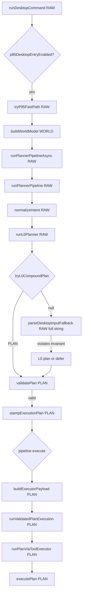
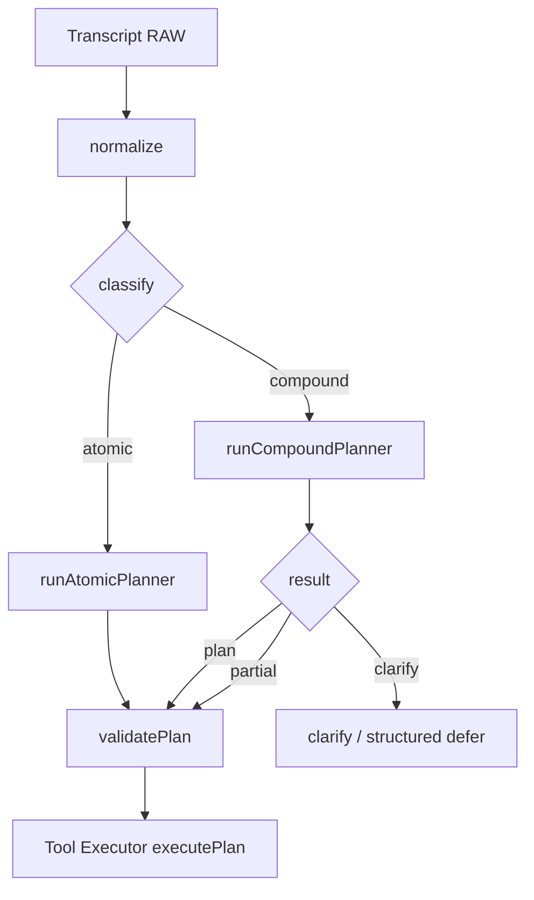

# P8.5 Voice Command — Runtime Execution Graph

**Purpose:** Function-level runtime graph from voice transcript to Tool Executor.  
**Scope:** Default production flags (`RIPPLE_P85_KILL` unset, `RIPPLE_P85_TOOL_EXECUTOR` default-on, legacy desktop routers off).  
**Last updated:** 2026-07-04 (rev 2 — architectural wording)

---

## Architectural summary

### Primary planner vs decentralized planning

There **is** a primary planner path:

```
runPlannerPipeline → runL0Planner
```

The problem is not the absence of a planner — it is that **there is no single authoritative planning stage**. Several other paths are allowed to produce or replace an `ExecutionPlan` later (async tiers, cache, recovery replan, legacy payload routers). **Planning is decentralized**, not missing.

### Plan construction paths

**At least eight plan construction paths currently exist** (see §10). This is not an invariant count — helper wrappers or future branches may add more. The important architectural fact is **decentralization**, not the exact number.

### Core invariant (most important)

Once `splitCompoundParts()` succeeds, the planner already knows sentence structure:

```
["open paint", "draw a circle"]
```

**Full-string parsers must never run on the original utterance again.**

Running `parseDesktopCommand("Open Paint and draw a circle")` after clause splitting is logically inconsistent — that parser should only ever see individual clauses (or structured compound context), not the recomposed sentence.

### Target architecture

```
Transcript
      │
      ▼
 normalize
      │
      ▼
 classify
      │
      ├──────── atomic
      │           │
      │           ▼
      │      runAtomicPlanner
      │
      └──────── compound
                  │
                  ▼
          runCompoundPlanner
                  │
          partial / clarify / plan
                  │
                  ▼
          validatePlan
                  │
                  ▼
         Tool Executor
```

This separation removes almost every ambiguity described in §4A and §10. Atomic behavior stays untouched until the compound path is stable.

### Async tiers (compound context)

For `compound_unresolved`, async tiers (cache, entity, grounded, GPT) **should not re-parse the raw utterance independently** as if it were a fresh atomic command.

That does **not** mean GPT must be skipped forever. An alternative (and likely P9 direction):

```
compound detected
      ↓
pass structured compound context (resolved steps + unresolved clauses)
      ↓
GPT continues planning unresolved clauses
```

Phase A may gate independent full-string replans; later phases may allow GPT to **finish** compound plans with structured input — not ignore them.

---

## Legend

| Column | Meaning |
|--------|---------|
| **Input** | What the function receives |
| **Consumes** | `RAW` = transcript string; `PLAN` = `ExecutionPlan`; `WORLD` = `WorldModel`; `PAYLOAD` = `CommandResultPayload` |
| **Output** | Return value / side effect |
| **Reaches executor?** | Whether this branch can call `executePlan()` |

---

## 0. Entry

```
INPUT: RunCommandInput { command: string, getAccessToken, ... }
```

| # | Function | Input | Consumes | Output | Executor? |
|---|----------|-------|----------|--------|-------------|
| 0.1 | `clearPreprocessCache()` | — | — | void | No |
| 0.2 | `parseUndoCommand(command)` | RAW | RAW | `UndoIntent \| null` | **Yes** → `runCommandActions` (bypasses P8.5) |
| 0.3 | `parseGoalControlCommand(command)` | RAW | RAW | cancel/pause/continue | No — meta only |
| 0.4 | `buildReferentialWhatsAppResult(command)` | RAW | RAW | `CommandResultPayload \| null` | **Yes** → `runCommandActions` |
| 0.5 | `tryLinkedInLocal(command)` | RAW | RAW | `CommandResultPayload \| null` | **Yes** → `runCommandActions` |

If none of the above return → continue to **§1 P8.5 entry**.

---

## 1. P8.5 desktop entry (`p85DesktopEntryEnabled()` === true)

| # | Function | Input | Consumes | Output | Executor? |
|---|----------|-------|----------|--------|-------------|
| 1.1 | `tryP85FastPath(command, detail, getAccessToken)` | RAW | RAW | `RunCommandResult \| null` | **Only path to Tool Executor** |

If `tryP85FastPath` returns non-null → **done** (success, clarify, or blocked).  
If returns `null` → fall through to **§8 Legacy orchestrator** (no Tool Executor on those branches by default).

---

## 2. `tryP85FastPath` — clarify merge

| # | Function | Input | Consumes | Output | Executor? |
|---|----------|-------|----------|--------|-------------|
| 2.1 | `resolveClarificationFollowUp(command)` | RAW | RAW | `{ mergedCommand, round } \| null` | No |
| 2.2 | `effectiveCommand` | — | RAW | `mergedCommand ?? command` | — |
| 2.3 | round > 2 | — | — | `{ ok: false, message }` | No |

---

## 3. World + async pipeline

| # | Function | Input | Consumes | Output | Executor? |
|---|----------|-------|----------|--------|-------------|
| 3.1 | `buildWorldModel()` | — | — | `WorldModel` | No |
| 3.2 | `runPlannerPipelineAsync({ command: effectiveCommand, world, getAccessToken })` | RAW + WORLD | RAW | `PlannerPipelineResult` | See §4–§7 |

---

## 4. `runPlannerPipeline` (sync tier — always runs first)

| # | Function | Input | Consumes | Output | Executor? |
|---|----------|-------|----------|--------|-------------|
| 4.1 | `ensureP85ToolsRegistered()` | — | — | void | No |
| 4.2 | `normalizeIntent(raw)` → `normalizeDesktopVoiceCommand` | RAW | RAW | `normalized: string` | No |
| 4.3 | `runL0Planner(raw, normalized, world)` | RAW + WORLD | RAW | `L0PlannerResult` | See **§4A** |

`runPlannerPipeline` → `runL0Planner` is the **primary** sync planner. It is not the only stage that may produce a plan — async tiers (§5) and recovery replan (§6B) can also construct or replace plans. There is no single authoritative planning stage today.

### 4.3a — L0 result routing

| L0 kind | Next function | Consumes | Output | Executor? |
|---------|---------------|----------|--------|-------------|
| `clarify` | return `{ kind: "clarify", question, ... }` | — | clarify | No |
| `defer` | return `{ kind: "defer", reason }` | — | defer → §5 async | No |
| `plan` | `validatePlan(l0.plan, world, raw)` | **PLAN** + RAW | `ValidationResult` | No |

### 4.3b — Post-L0 validation

| Condition | Function | Consumes | Output | Executor? |
|-----------|----------|----------|--------|-------------|
| `!validation.valid` | return defer `validation_failed:...` | PLAN | defer | No |
| `!passesConfidenceGate(l0.plan)` | return clarify (optional `plan`) | PLAN | clarify | No |
| else | `stampExecutionPlan(validation.sanitizedPlan ?? l0.plan, world)` | PLAN | `{ kind: "execute", plan, validation }` | → §6 |

---

## 4A. `runL0Planner` — full branch order (all consume RAW unless noted)

**Every branch below runs on the full `normalized` string unless compound succeeds early.**

| Order | Guard / trigger | Function(s) | Consumes | Output |
|-------|-----------------|-------------|----------|--------|
| A1 | empty | — | RAW | `defer: empty` |
| A2 | `isCalculatorForeground(world)` | `parseCalculatorInput(raw)` | RAW | `plan` (type_text) |
| A3 | `AMBIGUOUS_SEND` regex | — | RAW | `clarify` |
| A4 | `COMPOSE_WITH_BODY` regex | `planFromParsed` | RAW | `plan` (type_text) |
| A5 | `isComposeTopicOnlyCommand(raw)` | — | RAW | `defer: compose_needs_llm` |
| **A6** | **compound** | **`tryL0CompoundPlan(rawCommand, normalized)`** | **RAW** | **`PLAN \| null`** → see **§4B** |
| A7 | — | `parseDesktopInputFallback(raw)` | **RAW (full)** | `plan` via `planFromParsed` |
| A8 | — | `parseListDirectoryCommand(raw)` | **RAW (full)** | `plan` via `planFromListDirectory` |
| A9 | `DAAL_DO` regex | `planFromParsed` | RAW | `plan` |
| A10 | paste clipboard phrase | inline `ExecutionPlan` | RAW | `plan` (desktop.paste) |
| A11 | `READ_CLIPBOARD` regex | inline plan | RAW | `plan` (system.clipboard.read) |
| A12 | `COPY_TO_CLIPBOARD` regex | inline plan | RAW | `plan` (system.clipboard.write) |
| A13 | `PASTE_LITERAL` regex | `planFromParsed` | RAW | `plan` |
| A14 | clipboard context + paste phrase | inline plan | RAW | `plan` (desktop.paste) |
| A15 | — | `extractDirectTypingText(raw)` | **RAW (full)** | `plan` via `planFromParsed` |
| A16 | `OPEN_APP_FOR_MEMORY` regex | `firstCompoundClause` + `lookupBinding` + `resolveAppPhrase` | **RAW (full)** | `plan` (launch_app) |
| A17 | — | `parseWellKnownFolderOpen(raw)` | RAW | `plan` via `planFromOpenIntent` |
| A18 | — | `parseNativeCommandStrict(raw)` | **RAW (full)** | intent → `planFromFileOpIntent` / `planFromOpenIntent` / inline launch |
| A19 | — | `parseFileOperationCommand(raw)` | **RAW (full)** | `plan` via `planFromFileOpIntent` |
| A20 | — | `buildDesktopCommandResult(raw)` → `parseDesktopIntent` | **RAW (full)** | `filesystemPlanFromDesktopPayload` OR `_desktopPayload` launch plan |
| A21 | `shouldDeferWebCompose(raw)` | uses `parseDesktopInputFallback` internally | RAW | `defer: web_adapter_compose` |
| A22 | default | — | — | `defer: no_l0_match` |

**Violates core invariant:** After A6 returns `null`, branches A7–A20 re-parse the **full utterance** even though `splitCompoundParts()` may have already established clause structure. Full-string parsers must not see that string again once splitting succeeded.

---

## 4B. `tryL0CompoundPlan` (clause-local parsing only)

| # | Function | Input | Consumes | Output |
|---|----------|-------|----------|--------|
| B1 | `normalizeTranscript(rawCommand) \|\| normalized` | RAW | RAW | transcript |
| B2 | `splitCompoundParts(transcript)` | RAW | RAW | `string[] \| null` (≥2 parts) |
| B3 | per clause | `parseSimpleCompoundPart(part)` | **RAW (per clause)** | `NativeCommandIntent \| null` |
| B3a | | `parseSaveFileCommand(clause)` | RAW clause | intent |
| B3b | | `parseCalculatorInput(clause)` | RAW clause | intent |
| B3c | | `parseDesktopInputFallback(clause)` | RAW clause | intent |
| B3d | | `parseNativeCommandStrict(clause)` | RAW clause | intent (includes `parseDesktopCommand(clause)`) |
| B4 | any clause null | — | — | **`return null`** (all-or-nothing) |
| B5 | `isWave1Compound(intents)` | intents | — | bool |
| B6 | `nativeIntentsToPlanSteps(intents)` | intents | — | `PlanStep[]` |
| B7 | — | — | — | **`ExecutionPlan`** (source: L0) |

---

## 5. `runPlannerPipelineAsync` — async tiers (only if sync returned `defer`)

Precondition: `sync.kind === "defer"` AND `getAccessToken` provided.

| # | Condition | Function | Consumes | Output | Creates PLAN? |
|---|-----------|----------|----------|--------|---------------|
| 5.1 | always | `lookupCachedPlan(normalized, world)` | RAW + WORLD | `ExecutionPlan \| null` | Rehydrates cached PLAN |
| 5.2 | cache hit + valid | `pipelineExecuteFromCachedPlan` → `validatePlan` → `stampExecutionPlan` | **PLAN** | `execute` | No (reuse) |
| 5.3 | `reason === "no_l0_match"` | `tryEntityResolverPlan(raw, normalized, world)` | **RAW (full)** | `execute \| null` | **Yes** — inline `ExecutionPlan` |
| 5.3a | | `tryResolveLaunchIntent(raw)` | **RAW (full)** | launch intent | — |
| 5.4 | `reason === "no_l0_match"` | `tryGroundedPlannerResult(raw)` | **RAW (full)** | clarify \| payload | **Yes** if payload — inline plan with `_desktopPayload` |
| 5.5 | `shouldTryGptFallback(reason, raw)` | `tryGptPlannerFallback(...)` | **RAW (full)** | execute \| clarify \| defer | **Yes** via `executionPlanFromLlmPlan` |
| 5.6 | else | return sync defer | — | defer | No |

**GPT path detail (`tryGptPlannerFallback`):**

| Step | Function | Consumes | Output |
|------|----------|----------|--------|
| G1 | `fetchDesktopIntentFromLlm(accessToken, raw, ...)` | RAW | `DesktopIntentPlan` |
| G2 | `executionPlanFromLlmPlan(llmPlan, raw, normalized)` | RAW | **ExecutionPlan** (source: GPT) |
| G3 | `validatePlan` → `passesConfidenceGate` | PLAN | execute \| clarify \| defer |
| G4 | `storeCachedPlan(normalized, world, plan)` | PLAN | cache write (GPT only) |

---

## 6. `tryP85FastPath` — post-pipeline execution

| Pipeline kind | Function | Consumes | Output | Executor? |
|---------------|----------|----------|--------|-------------|
| `clarify` | `beginClarificationRound` + overlay | optional PLAN | `{ ok: false, message }` | No |
| `execute` | `buildExecutorPayload(pipeline.plan, command, world)` | **PLAN** + RAW | `PlannerExecutorResult` | → §6A |
| `defer` | `logShadowLegacyDesktopRouters(command, reason)` | **RAW** (shadow) | `null` | No |

### 6A. `buildExecutorPayload`

| Step | Function | Consumes | Output |
|------|----------|----------|--------|
| 6A.1 | `validatePlan(plan, world, command)` | PLAN + RAW | valid \| invalid |
| 6A.2 | `passesConfidenceGate(sanitized)` | PLAN | executor \| clarify \| invalid |
| 6A.3 | `executionPlanToPayload(sanitized, command)` | **PLAN** | `CommandResultPayload` |
| 6A.4 | `getPermissionBlockMessage(command, payload)` | RAW + PAYLOAD | blocked \| ok |
| 6A.5 | `planEligibleForToolExecutor(sanitized)` | **PLAN** | bool |
| 6A.6 | route | — | `{ kind: "executor", plan, payload }` OR `{ kind: "payload", plan, payload }` |

### 6B. `runValidatedPlanExecution`

| Step | Function | Consumes | Output |
|------|----------|----------|--------|
| 6B.1 | `routeForPlan(plan, built.kind)` | PLAN | `"executor" \| "payload"` |
| 6B.2 | `logExecutionPlan(plan, "executor-in")` | PLAN | log |
| 6B.3a | if executor | `runPlanViaToolExecutor(plan, command, world)` | **PLAN** | → **§7** |
| 6B.3b | if payload | `runCommandActions(payload)` | PAYLOAD | legacy action runner (not Tool Executor) |
| 6B.4 | on failure | `attemptP85Recovery` → optional `replan: runPlannerPipelineAsync(command)` | **RAW** | may replace PLAN |

---

## 7. Tool Executor (`executePlan`)

| Step | Function | Consumes | Output |
|------|----------|----------|--------|
| 7.1 | `createExecutionContext({ world, resolved, capabilities })` | WORLD | ctx |
| 7.2 | per `plan.steps[i]` | | |
| 7.2a | `checkRateLimitForTool(step.tool)` | step | blocked \| continue |
| 7.2b | `dependsOnTools` check | PLAN steps | blocked \| continue |
| 7.2c | `permissionPass1ForStep` | RAW + step | blocked \| continue |
| 7.2d | `bindStepArgs(step.tool, step.args, resolved)` | PLAN step args | resolved args |
| 7.2e | `permissionPass2ForStep` | args | blocked \| continue |
| 7.2f | `confirmStepIfNeeded` | args + RAW | blocked \| continue |
| 7.2g | `pushUndoBeforeMutate` | step | undo stack |
| 7.2h | **`executeToolForExecutor(step.tool, ctx, resolvedArgs)`** | PLAN step | `ToolResult` |
| 7.2i | `observeToolStep` | step + WORLD | observation |
| 7.2j | `refreshExecutionContext` | WORLD | ctx |
| 7.3 | return | PLAN | `ToolExecutorSummary { ok, records, replanned: false }` |

---

## 8. Legacy fallthrough (when `tryP85FastPath` returns `null`)

**Default: these do NOT reach Tool Executor.** They use `runCommandActions` on `CommandResultPayload`.

| Order | Function | Consumes | Output | Executor? |
|-------|----------|----------|--------|-------------|
| 8.1 | `tryDesktopInputFastPath` | RAW | payload | No (legacy flag) |
| 8.2 | `tryLegacyDesktopFastPath(desktopFast)` | RAW + PAYLOAD | payload | No (legacy flag) |
| 8.3 | `buildDesktopCommandResult(command)` | **RAW (full)** | PAYLOAD | No |
| 8.4 | `tryAgentCompoundCommand(command)` | **RAW (full)** | PAYLOAD | No |
| 8.5 | WhatsApp / YouTube / LinkedIn / Instagram locals | RAW | PAYLOAD | No |
| 8.6 | `planDesktopCommand` | RAW | PAYLOAD | No (legacy flag `RIPPLE_P85_LEGACY_PLAN=1`) |
| 8.7 | `runBackendCommandFlow` | RAW | PAYLOAD via socket/REST | No |

`logShadowLegacyDesktopRouters` (shadow only, no execute):
- `buildDesktopInputPayload(command)` → `parseDesktopInputFallback(RAW)`
- `buildDesktopCommandResult(command)` → `parseDesktopIntent(RAW)`

---

## 9. Mermaid — current vs target

### Current (bug: full-string fallback after split)



### Target (classify → atomic | compound)



---

## 10. Decentralized plan construction paths (audit checklist)

**At least eight plan construction paths currently exist.** More may appear via helpers or future branches. These paths can **create or replace** an `ExecutionPlan` or **re-parse RAW independently** after compound splitting has already succeeded:

| # | Location | Trigger | Consumes | Risk |
|---|----------|---------|----------|------|
| H1 | `runL0Planner` A7–A20 | compound `null` | RAW full | violates core invariant; `filesystem.open` greedy match |
| H2 | `tryEntityResolverPlan` | defer `no_l0_match` | RAW full | independent full-string replan |
| H3 | `tryGroundedPlannerResult` | defer `no_l0_match` | RAW full | `_desktopPayload` plan from raw |
| H4 | `tryGptPlannerFallback` | GPT candidate defer | RAW full | GPT plan replaces L0 from raw |
| H5 | `lookupCachedPlan` | any defer + cache hit | cached PLAN | stale plan for changed compound context |
| H6 | `attemptP85Recovery.replan` | executor failure | RAW full | full independent replan |
| H7 | `logShadowLegacyDesktopRouters` | p85 defer | RAW full | shadow only (no execute) |
| H8 | `runDesktopCommand` §8 | p85 null | RAW full | legacy payload (no executor) |

**Executor entry (single path):**  
`tryP85FastPath` → `pipeline.kind === "execute"` → `buildExecutorPayload` → `runValidatedPlanExecution` → `runPlanViaToolExecutor` → `executePlan`.

**Authoritative planning stage (missing today):**  
Primary path is `runPlannerPipeline` → `runL0Planner`, but H2–H6 and others may still produce competing plans. There is **no single authoritative planning stage** — only a primary path with secondary planners allowed afterward.

---

## 11. Example trace: `Open Paint and draw a circle`

| Step | Function | Consumes | Result |
|------|----------|----------|--------|
| 1 | `tryL0CompoundPlan` | RAW clauses | split `["Open Paint","draw a circle"]`; draw fails → **null** |
| 2 | *(invariant violation)* | — | L0 falls through to full-string parsers despite successful split |
| 3 | `parseNativeCommandStrict` | **RAW full** | `parseDesktopCommand` → item `"Paint and draw a circle"` |
| 4 | `planFromOpenIntent` | intent | **PLAN: 1× `filesystem.open`** |
| 5 | `validatePlan` | PLAN | valid |
| 6 | `executePlan` | PLAN | runs `filesystem.open` — **wrong** |

Never reaches legacy §8 because P8.5 "succeeds" at step 5. **Fix:** after split succeeds, only clause-local or structured-context planning — never step 3.

---

# Implementation & E2E Test Plan (pre–Phase A)

## Goals

1. Document and lock the runtime graph with automated traces.
2. Implement Phase A (compound gate) enforcing the **core invariant**: no full-string replan after `splitCompoundParts()` succeeds.
3. Establish a **single authoritative planning stage** for compound (via `runCompoundPlanner`) without breaking atomic `runAtomicPlanner`.
4. Prove Tool Executor receives the correct PLAN for compound + atomic utterances.

## Phase 0 — Trace harness (no behavior change)

### 0.1 Planner trace spy

Add `RIPPLE_P85_TRACE=1` logging in:

- `runL0Planner` — log branch id (A1–A22) and whether input is full RAW vs clause
- `runPlannerPipelineAsync` — log tier (sync / cache / entity / grounded / gpt)
- `buildExecutorPayload` — log `plan.steps.map(s => s.tool)`

### 0.2 Trace assertion test file

Create `electron/agent/__tests__/phase-p85-runtime-trace.spec.ts`:

| Test | Utterance | Assert planner-out tools | Assert no call |
|------|-----------|--------------------------|----------------|
| T0-atomic-type | `type hello` | `["desktop.type_text"]` | — |
| T0-atomic-open | `open notepad` | `["desktop.launch_app"]` | — |
| T0-compound-ok | `open notepad and type hello` | `["desktop.launch_app","desktop.type_text"]` | — |
| T0-compound-fail | `open paint and draw a circle` | **not** `filesystem.open` | `parseDesktopCommand` on full string (after Phase A) |
| T0-save | `type notes and save as x.txt` | includes `desktop.save_file` | — |

### 0.3 Log contract

grep dev console for:

```
[ripple-p85] execution-plan stage=planner-out
[ripple-p85] execution-plan stage=executor-in
```

---

## Phase A — Compound gate implementation

### A.1 `classifyUtterance(raw) → "compound" | "atomic"`

- Reuse `splitCompoundParts(normalizeTranscript(raw)) !== null`
- Unit tests: comma clauses, and/then, single clause → atomic

### A.2 `runL0Planner` restructure

```
if classify === "compound":
  result = runCompoundPlanner(raw, normalized)  // tryL0CompoundPlan + partial/clarify
  if result.plan → return plan
  if result.clarify → return clarify
  return defer compound_unresolved   // NEVER fall through to A7–A20
return runAtomicPlanner(raw, normalized, world)  // move A2–A5 + A7–A22 here
```

### A.3 `parseDesktopCommand` guard

- If `hasCompoundTailAfterFirstClause(itemName)` → return null
- Test: `open paint and draw a circle` → null from `parseDesktopCommand`

### A.4 Orchestrator gate

In `tryP85FastPath` when pipeline defers with `compound_unresolved`:

- Return `{ ok: false, message: clarify }` — **not** `null`
- Prevents §8 legacy `buildDesktopCommandResult` on compound utterances

### A.5 Async tier gate (no independent full-string replan)

In `runPlannerPipelineAsync`, when defer reason is `compound_*`:

- **Block** entity, grounded, GPT, and cache from re-parsing the raw utterance **independently** (as if atomic)
- Return clarify / structured defer to orchestrator
- **Do not** treat "skip GPT" as permanent — future P9 may pass structured compound context (`resolvedSteps`, `unresolvedClauses`) so GPT can finish unresolved clauses without seeing the recomposed full string as a fresh atomic command

### A.6 Env flag

- `RIPPLE_P85_COMPOUND_STICKY=0` → rollback to current behavior

---

## Phase A — E2E verification matrix

Run with `npm run dev`, voice or typed command, verify logs.

| # | Command | Expected `planner-out` steps | Must NOT appear | Executor? |
|---|---------|---------------------------|-----------------|-----------|
| E1 | `type hello` | 1× type_text | — | Yes |
| E2 | `open notepad` | 1× launch_app | filesystem.open | Yes |
| E3 | `open notepad and type hello` | 2× launch + type | — | Yes |
| E4 | `open paint and draw a circle` | 1× launch_app + clarify OR defer compound | filesystem.open | No / partial later |
| E5 | `type meeting notes, save as notes.txt in downloads` | 2× type + save_file | — | Yes |
| E6 | `open downloads` | 1× filesystem.open | launch_app | Yes |
| E7 | `read clipboard` | 1× system.clipboard.read | — | Yes |

### E2E script (automated)

```bash
npm run test:p85 -- phase-p85-runtime-trace.spec.ts
npm run test:p85  # full regression
```

### Manual voice checklist

- [ ] Overlay shows clarify (not silent wrong action) for E4
- [ ] `execution-plan stage=planner-out` step count matches table
- [ ] No `[ripple-desktop] desktop-fast` log for E4 (legacy not running)
- [ ] `tool-executor route` log present for E1–E3, E5–E7

---

## Phase B — Partial plans (after Phase A green)

| Task | Description | Test |
|------|-------------|------|
| B.1 | `PlannerPipelineResult` kind `partial` | unit ✅ |
| B.2 | `runCompoundPlanner` emit partial on clause fail | E4 → launch + clarify ✅ |
| B.3 | Orchestrator execute resolved steps then clarify | integration ✅ |
| B.4 | `validatePartialPlan` (steps > 0, unresolved separate) | unit ✅ |
| B.5 | Browser tab resolver + `browser.open_workspace` compound | `switch chrome + open youtube` ✅ |
| B.6 | App vs workspace tool separation + `browser.search_workspace` | unit ✅ |
| B.7 | Legacy desktop-fast blocked when P8.5 owns command | no shadow mismatch ✅ |

---

## PR sequence

Rollout order minimizes regression risk: **atomic behavior untouched** until compound path is stable.

| PR | Contents | Gate |
|----|----------|------|
| PR0 | Trace harness + `phase-p85-runtime-trace.spec.ts` | test:p85 green |
| PR1 | Sticky compound gate: classify + `runAtomicPlanner` / `runCompoundPlanner` split + `parseDesktopCommand` guard | E4 fails today, passes after; core invariant enforced in L0 |
| PR2 | Orchestrator gate + async tier gate (no independent full-string replan on `compound_*`) | no legacy fallthrough E4 |
| PR3 | Phase B partial plans | E4 executes paint + clarify |
| PR4+ | Clause registry, demote `filesystem.open`, legacy shadow-only cleanup | vocabulary growth; H7/H8 retirement — **see [P8.5-PLANNER-V2.md](./P8.5-PLANNER-V2.md)** |

---

## Success criteria (Phase A done)

- [x] **Core invariant:** once `splitCompoundParts()` succeeds, no full-string parser runs on the original utterance in the L0 path (sticky gate + `runCompoundPlanner`)
- [x] §10 H1 eliminated for compound utterances (`open paint and draw a circle` → clarify, not `filesystem.open`)
- [x] H2–H6 cannot independently re-parse raw utterance on `compound_*` defer (async `compound_gate`)
- [x] `test:p85` — **318 passed** (incl. `phase-p85-runtime-trace.spec.ts`)
- [ ] E1–E7 manual/automated matrix green (voice dev verification)
- [x] Compound clauses consumed only by `runCompoundPlanner` when sticky on (`RIPPLE_P85_COMPOUND_STICKY=0` restores legacy fallthrough)
