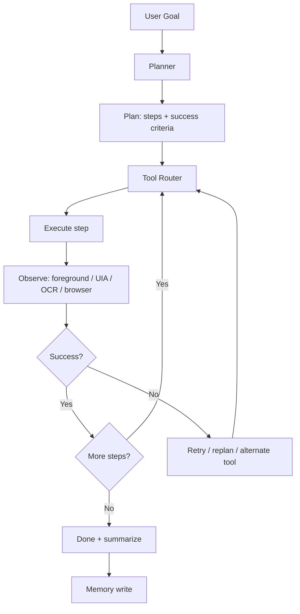
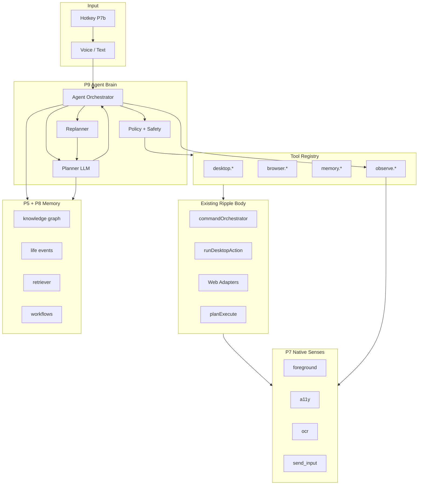

# P9+ — From Commands to Jarvis: Agent Brain Architecture

**Project:** Ripple Desktop  
**Status:** Architecture proposal (post-P7) — **P9a MVP in progress** (July 2026)
**Audience:** Founders, engineers, Cursor agents  
**Last updated:** July 2026

---

## Executive summary

Ripple has spent P0–P8 building a strong **body**: desktop automation, browser adapters, memory, retrieval, knowledge graph, and (now) a native Windows sidecar. The system still **thinks like a command router** — it maps one utterance → one intent → one action batch.

To feel like **Jarvis**, Ripple needs a new layer on top: an **Agent Orchestrator** that accepts **goals**, produces **multi-step plans**, **selects tools**, **executes**, **observes**, **retries**, and **remembers** — without the user memorizing phrases.

This document answers the architectural questions for that transition and proposes **P9–P12**.

---

## Where Ripple is today (P0–P8 + P7)

### Phase map (what you already built)

| Phase | What it is | Role in future agent |
|-------|------------|----------------------|
| **P4** | Voice NLU, local parsers, GPT desktop-intent, adapters (Gmail, WhatsApp, etc.) | Becomes **tools**, not the brain |
| **P5** | Knowledge graph, workflows, aliases | **Long-term memory + habits** |
| **P6** | Telemetry, observability | **Agent health + learning signals** |
| **P7** | Native OS sidecar (`ripple-native.exe`) | **Sensors + actuators** for the agent loop |
| **P8** | Semantic memory, retriever, life events | **Recall + context** for planning |

### P7 completion status (as of July 2026)

P7 is the **native Windows layer** — the agent's hands and eyes on the OS.

| Sub-phase | Feature | Status |
|-----------|---------|--------|
| **P7a** | Rust sidecar, named pipe, auth, session file, watchdog | ✅ Done |
| **P7b** | `RegisterHotKey` (Ctrl+Space, Alt+Shift+Space, Escape) | ✅ Done |
| **P7c** | Foreground events (`SetWinEventHook`), `get_foreground` | ✅ Done |
| **P7d** | `SendInput` — `send_keys`, `run_input_sequence` | ✅ Done |
| **P7e** | UI Automation — `get_focused_a11y` | ✅ Done |
| **P7f** | WinRT OCR — `screenshot_ocr`, electron-builder bundling | ✅ Done |
| **P7c gap** | `list_windows` RPC | ✅ Done (added with P7f) |
| **P7c gap** | `focus_window`, `close_window`, `minimize_all` native RPC | ⏳ PowerShell fallback |
| **P7+** | Mouse click/scroll/drag | ❌ Not started |
| **P7f optional** | Code signing, Task Scheduler auto-start | ⏳ Deferred |

**What P7 gives the agent (critical for P9):**

```
Sensors (observe)          Actuators (act)
─────────────────          ─────────────────
get_foreground             send_keys / run_input_sequence
foreground_changed events  (future: focus_window, mouse)
get_focused_a11y           list_windows
screenshot_ocr
get_capabilities
```

P7 solved **reliability** and **latency** for OS I/O. It did **not** solve **understanding** or **multi-step reasoning**. That is P9's job.

### The current command flow (why "say anything" fails)

```
User speech
    ↓
Whisper transcript
    ↓
commandOrchestrator.runDesktopCommand()
    ↓
┌─────────────────────────────────────────────────────┐
│ 1. Local fast path (regex) — exact phrases only     │
│ 2. buildDesktopInputPayload — typing/edit keys      │
│ 3. buildDesktopCommandResult — open/move/delete     │
│ 4. planDesktopCommand — GPT single-intent planner   │
│ 5. Backend /commands/execute — web intents          │
└─────────────────────────────────────────────────────┘
    ↓
ONE action payload → execute → done (or SHOW_SUGGESTIONS / not_found)
```

**Root cause:** There is no **goal loop**. GPT returns a **single** `DesktopIntentPlan` (open folder, launch app, etc.). Typing often misses because:

- Local parser only matches fixed English phrases (`Type hello`, `Select all`)
- GPT planner has no `type_text` action in `intentFromLlm.ts` mapping
- Backend may return `SHOW_SUGGESTIONS` instead of `INSERT_TEXT`
- No observation step confirms the action worked

**P7 made execution reliable. P9 must make understanding and planning reliable.**

---

## The target: Goal-driven agent loop

Jarvis is not "better commands." It is a **closed loop**:



**One utterance can spawn many steps.** The user says *"Prepare me for my interview tomorrow"* — the agent decomposes, executes, observes, adapts.

---

## 1️⃣ Transition: command automation → goal-driven agent

### Recommendation

**Do not replace** the existing stack. **Wrap it.**

```
┌────────────────────────────────────────────────────────────┐
│  P9 Agent Orchestrator (NEW)                               │
│  goal → plan → step loop → observe → retry → complete        │
├────────────────────────────────────────────────────────────┤
│  Tool Registry (NEW)                                       │
│  desktop.* | browser.* | memory.* | search.* | ocr.*       │
├────────────────────────────────────────────────────────────┤
│  EXISTING (keep)                                           │
│  commandOrchestrator | planExecute | runDesktopAction      │
│  adapters (Gmail, WA, LinkedIn…) | nativeHost | P8 retriever│
└────────────────────────────────────────────────────────────┘
```

### Three layers of understanding (cost ladder)

Keep the current fast path for speed and offline safety. Add agent layer for everything else.

| Layer | When | Latency | Example |
|-------|------|---------|---------|
| **L0 — Reflex** | Exact local match | &lt;50ms | `Open Downloads`, `Undo` |
| **L1 — Single-intent GPT** | Current `planDesktopCommand` | 1–3s | `Open the PDF I edited yesterday` |
| **L2 — Agent planner** | Multi-step goals, ambiguous speech | 3–30s | `Prepare for my interview tomorrow` |

**Rule:** L0/L1 stay for atomic commands. L2 activates when:

- Utterance has goal language (`prepare`, `help me`, `set up`, `before my meeting`)
- Multiple intents detected
- L1 returns `not_found` or `SHOW_SUGGESTIONS`
- User says "keep going" / continues a session goal

### What changes in code (high level)

| Today | P9 |
|-------|-----|
| `runDesktopCommand()` returns after one batch | `runAgentGoal()` loops until done or blocked |
| `DesktopIntentPlan` = one action | `AgentPlan` = `{ goal, steps[], success_checks[] }` |
| `intentFromLlm.ts` maps 15 actions | **Tool schemas** with 40+ tools |
| No post-action verify | **Observer** reads foreground + UIA + OCR |
| `conversationContext` for GPT hints | **Session state machine** + episodic log |

---

## 2️⃣ Planner: how should GPT decide tools?

### Recommendation: **OpenAI-style function calling + thin orchestrator in TypeScript**

**Not** full LangChain/AutoGen in v1. **Maybe** LangGraph-style state machine later.

| Option | Verdict for Ripple |
|--------|-------------------|
| **Function calling (tool schemas)** | ✅ **Primary** — maps cleanly to existing actions |
| **Custom TypeScript orchestrator** | ✅ **Primary** — you already have `planExecute.ts`, `commandOrchestrator.ts` |
| **MCP** | ✅ **Phase 10** — expose tools to external agents / future plugins |
| **LangGraph** | ⚠️ **Optional P10** — good for complex branching; adds dependency |
| **LangChain** | ❌ **Avoid as core** — heavy, hard to debug in Electron |
| **AutoGen** | ❌ **Overkill** — multi-agent chatter not needed yet |

### Planner contract (new)

```typescript
type AgentPlan = {
  goal_id: string;
  goal_summary: string;
  steps: AgentStep[];
  assumptions: string[];
  risk_level: "low" | "medium" | "high";
};

type AgentStep = {
  id: string;
  tool: string;           // e.g. "desktop.launch_app"
  args: Record<string, unknown>;
  success_check: SuccessCheck;
  on_failure: "retry" | "replan" | "skip" | "ask_user";
  max_retries: number;
};
```

GPT receives:

- User goal + transcript
- **Tool catalog** (JSON schemas)
- **Context pack** (last 5 turns, foreground app, focused field, P8 recall, KG entities)
- **Capability flags** from P7 sidecar (`sendInput`, `uia`, `ocr`, …)

GPT returns **structured plan**, not raw commands.

### Where it lives

```
electron/agent/
├── agentOrchestrator.ts    # main loop
├── toolRegistry.ts         # all tools + schemas
├── planner.ts              # LLM plan generation
├── observer.ts             # post-step verification
├── replanner.ts            # failure recovery
└── sessionState.ts         # long-running goal state
```

Existing `planExecute.ts` becomes **one tool path** inside `desktop.plan_atomic`.

---

## 3️⃣ Tool selection: Desktop vs Browser vs Memory vs OCR

### Recommendation: **Router is part of the planner, not a separate model**

Give GPT **one unified tool list** with clear descriptions and **context hints**. The model picks tools; code enforces policy.

### Tool families

| Family | Tools | Backed by |
|--------|-------|-----------|
| **desktop.*** | `launch_app`, `focus_window`, `type_text`, `press_keys`, `open_path`, `file_op` | P4 + P7 + `runDesktopAction` |
| **browser.*** | `open_url`, `gmail.*`, `whatsapp.*`, `linkedin.*` | Chrome extension + adapters |
| **memory.*** | `recall_file`, `recall_contact`, `remember_fact`, `search_semantic` | P8 retriever, life events, KG |
| **observe.*** | `get_foreground`, `get_focused_field`, `screenshot_ocr`, `list_windows` | P7 sidecar |
| **search.*** | `search_files`, `search_web` | retriever + browser |
| **workflow.*** | `run_workflow`, `save_workflow` | P5 workflow graph |

### Automatic selection rules (code-enforced)

```typescript
// Policy layer — runs BEFORE execute, regardless of GPT choice
if (tool === "desktop.type_text" && isGmailComposeFocused()) {
  redirect to "browser.gmail.compose";
}
if (tool === "desktop.launch_app" && isWebOnlyApp(name)) {
  redirect to "browser.open_url";
}
if (needs_screen_text && caps.ocr) {
  prefer "observe.screenshot_ocr" over blind typing;
}
if (destructive file_op) {
  require confirm or undo stack (existing P4.7);
}
```

**User never says "use OCR."** The planner sees `observe.screenshot_ocr` in the tool list with description: *"Read visible text from foreground window when you need to verify UI state or extract content."*

### Context injection (critical)

Every planner call includes:

```json
{
  "foreground": { "processName": "notepad", "windowTitle": "Untitled" },
  "focused_a11y": { "controlType": "Edit", "name": "" },
  "capabilities": { "sendInput": true, "uia": true, "ocr": true },
  "active_adapter": null,
  "last_action_outcome": "success",
  "recalled_entities": ["interview", "resume.pdf"]
}
```

P7 sensors make tool selection **grounded in reality**, not guesswork.

---

## 4️⃣ Multi-step reasoning

### Example: "Prepare me for my interview tomorrow"

**Today:** Fails or does one random action.  
**P9:** Planner emits a plan like:

| Step | Tool | Args |
|------|------|------|
| 1 | `memory.search_semantic` | `{ query: "interview", time: "tomorrow" }` |
| 2 | `search.files` | `{ token: "resume", extension: "pdf" }` |
| 3 | `desktop.open_path` | `{ path: "..." }` |
| 4 | `desktop.launch_app` | `{ app: "chrome" }` |
| 5 | `browser.open_url` | `{ url: "interview questions for software engineer" }` |
| 6 | `desktop.launch_app` | `{ app: "notepad" }` |
| 7 | `desktop.type_text` | `{ text: "Interview prep notes:\n- ..." }` |
| 8 | `observe.screenshot_ocr` | verify Notepad has content |

User sees **progress stream**: *"Found your resume → opened Chrome → created notes."*

### Implementation

- **User workflows (P5)** become **plan templates** the agent can instantiate
- **KG** suggests apps user actually uses (`chrome` vs `edge`)
- **Life events (P8)** anchor time ("interview tomorrow" → calendar entity)
- Plan stored in `sessionState` — survives across multiple voice turns

### Phrasing flexibility

Multi-step agent mode accepts:

- *"Prepare me for my interview tomorrow"*
- *"Help me get ready for the meeting"*
- *"I have an interview, set me up"*

Single-step L0/L1 still handles *"Open Notepad"* instantly without agent overhead.

---

## 5️⃣ Self-correction ⭐⭐⭐⭐

### Recommendation: **Retry policy per step, not hope**

```typescript
type FailureHandler = {
  detect: (observation: Observation) => boolean;
  strategies: RetryStrategy[];
};

// Example: launch_app failure
strategies: [
  { tool: "desktop.launch_app", args: { app: "chrome" } },
  { tool: "desktop.launch_app", args: { app: "edge" } },
  { tool: "desktop.open_path", args: { path: "https://..." } },  // default browser
  { tool: "agent.ask_user", args: { question: "Which browser should I use?" } },
]
```

### Failure signals (use all available)

| Signal | Source |
|--------|--------|
| Action threw error | `runDesktopAction` / adapter |
| Foreground didn't change | P7 `get_foreground` before/after |
| Wrong window focused | `processName` / `windowTitle` mismatch |
| Text field empty after type | P7 `get_focused_a11y` |
| Expected text not on screen | P7 `screenshot_ocr` contains check |
| Browser tab wrong | extension focus context |

### Replan trigger

After `max_retries`, call **replanner** with:

- Original goal
- Completed steps
- Failure observation
- Remaining steps (cancelled)

Replanner returns **patched plan** — don't restart from scratch.

### User visibility

```
Couldn't open Chrome — trying Edge…
Edge opened — continuing.
```

Silent retries for low-risk steps; speak on strategy change.

---

## 6️⃣ Observation ⭐⭐⭐⭐

### Recommendation: **Mandatory observe hook after every mutating step**

```typescript
async function executeStep(step: AgentStep): Promise<StepResult> {
  const before = await observe();           // P7 sensors
  const result = await invokeTool(step);    // act
  await sleep(step.settle_ms ?? 300);       // UI settle
  const after = await observe();
  return verify(step.success_check, before, after, result);
}
```

### Observation bundle (`observe()`)

| Reading | RPC / API | Use |
|---------|-----------|-----|
| Foreground window | `get_foreground` | Did focus change? |
| Focused control | `get_focused_a11y` | Are we in an edit field? |
| Visible text | `screenshot_ocr` | Did text appear? Correct app? |
| Window list | `list_windows` | Find target by title |
| Browser context | `focusContext.ts` | Which tab/site? |
| File exists | `fs.existsSync` | File ops succeeded? |

### Success check examples

```json
{ "type": "foreground_process", "equals": "notepad" }
{ "type": "a11y_control", "controlType": "Edit" }
{ "type": "ocr_contains", "text": "Interview prep" }
{ "type": "file_exists", "path": "..." }
```

**This is the single biggest missing piece today.** P7 built the sensors; P9 must wire them into the loop.

---

## 7️⃣ Memory: permanent vs temporary

### Recommendation: **Four memory tiers**

| Tier | Storage | TTL | What goes here |
|------|---------|-----|----------------|
| **Working** | `sessionState` in RAM | Session / goal | Current plan, step index, last observation |
| **Episodic** | `conversationContext` + action log | Hours–days | Turns, outcomes, what worked/failed |
| **Semantic** | P8 life events, retriever index | Months+ | "Interview tomorrow", "tax documents" |
| **Structural** | P5 knowledge graph | Long-term | Apps, aliases, workflows, entity boosts |

### Write rules (agent decides via tool)

| Event | Write to |
|-------|----------|
| User said "remember that…" | Semantic + KG |
| Goal completed successfully | Episodic summary + optional workflow template |
| App launch succeeded 3x for goal type | KG boost `app_role` |
| Transcript noise, filler | Nothing |
| Passwords, tokens, secrets | **Never** (policy block) |
| OCR of screen | Episodic only unless user asks to remember |

### Tool: `memory.commit`

GPT calls explicitly when user wants remembrance. Background writes only for **high-confidence** patterns (existing `recordDesktopAction`, `boostEntityFromOpen`).

---

## 8️⃣ Long conversations (hours / days)

### Problem

Full chat history → token blowup, slow planner, confused context.

### Recommendation: **Rolling context pack**

```
┌─────────────────────────────────────┐
│ System: agent rules + tool catalog  │
├─────────────────────────────────────┤
│ Goal state: active goal or null     │
│ Summary: 200-token rolling summary  │
├─────────────────────────────────────┤
│ Recent: last 5 turns verbatim       │
├─────────────────────────────────────┤
│ Recalled: P8 top-k for current goal │
│ KG: relevant entities (top 10)      │
├─────────────────────────────────────┤
│ Sensors: foreground + a11y snapshot │
└─────────────────────────────────────┘
```

### Mechanisms

1. **Goal sessions** — multi-hour tasks get `goal_id`; unrelated chatter doesn't pollute
2. **Auto-summarize** every N turns → `conversationContext.rolling_summary`
3. **P8 retriever** pulls only relevant past facts per goal
4. **"New topic" detection** — planner clears working memory, keeps KG
5. **User says "continue"** — reload `sessionState` from disk

### Storage

```
%LOCALAPPDATA%/Ripple/agent-sessions/{goal_id}.json
```

---

## 9️⃣ Jarvis architecture (full picture)



### What makes it "Jarvis" vs "automation"

| Automation tool | Jarvis agent |
|-----------------|--------------|
| User memorizes commands | User states goals |
| One shot | Loop until done |
| No verification | Observe every step |
| Fixed parser | LLM + tools + policy |
| Fails silently | Retry + replan + explain |
| No memory of attempt | Episodic learning |

---

## 🔟 Best AI stack for production

### Recommendation for Ripple

| Component | Choice | Why |
|-----------|--------|-----|
| **Planning LLM** | OpenAI GPT-4.1 / o4-mini (or current best) | Structured output, tool calling, reliability |
| **Tool protocol** | OpenAI function calling (JSON Schema) | Industry standard, debuggable |
| **Orchestrator** | **Custom TypeScript** in Electron | You own the loop; no framework lock-in |
| **State machine** | Start simple (`switch` + `sessionState`); adopt **LangGraph** in P10 if branching explodes | |
| **MCP** | P10 — expose `ripple.tools` to Cursor/external agents | Future ecosystem |
| **Local LLM** | Optional P11 for offline L0 reflex expansion | Not required for v1 agent |
| **LangChain** | Avoid as runtime dependency | Use patterns, not the library |
| **AutoGen** | Skip | Multi-agent overhead |

### Why not LangChain as core?

- Electron app needs **predictable** execution paths
- You already have `commandOrchestrator`, `planExecute`, safety, undo
- LangChain adds abstraction layers that hide failures
- Harder to test in Vitest

### Why function calling wins

Your tools **already exist** as functions:

```typescript
// Today
await launchNativeApp("notepad");
await sendKeysNative({ text: "hello" });
await getFocusedA11yElement();

// P9 — same functions, schema wrapper
tools.register("desktop.type_text", {
  schema: { text: "string", replace_all: "boolean?" },
  execute: (args) => sendKeysNative({ text: args.text }),
  observe: verifyTextAppeared,
});
```

---

## Phase roadmap: P9 and beyond

### P9 — Agent Orchestrator (the brain) — **8–12 weeks**

**Goal:** User describes goals; Ripple plans, executes, observes, retries.

| Deliverable | Description |
|-------------|-------------|
| `agentOrchestrator.ts` | Goal loop with step execution |
| `toolRegistry.ts` | 30+ tools wrapping existing code |
| `planner.ts` | LLM → `AgentPlan` via function calling |
| `observer.ts` | P7 before/after snapshots |
| `replanner.ts` | Failure recovery |
| `sessionState.ts` | Multi-turn goals |
| Backend route | `/agent/plan` or extend `/commands/desktop-intent` |
| Typing tool | `desktop.type_text` — **fixes "say anything" for input** |
| UI | Progress toasts / step stream in overlay |

**Exit criteria:** *"Prepare interview notes"* completes 5+ steps without user specifying each command.

---

### P10 — Grounded computer use — **6–10 weeks**

| Deliverable | Description |
|-------------|-------------|
| P7 mouse RPC | click, scroll, drag (new native methods) |
| `observe.screen` | Full screenshot + OCR regions |
| UIA tree walk | Find button by name → click |
| MCP server | External tool access |
| LangGraph (optional) | Complex branching workflows |
| Plan templates | KG-learned workflows auto-suggested |

**Exit criteria:** *"Click the Save button"* works in Notepad, Word, common dialogs.

---

### P11 — Proactive + personalization — **ongoing**

| Deliverable | Description |
|-------------|-------------|
| Proactive suggestions | "You have a meeting in 10 min" |
| Habit learning | KG weights from episodic success |
| Multi-language goals | Urdu/Hindi goal parsing |
| Local reflex model | Small classifier for common intents offline |
| Calendar / email integration | Time-aware planning |

---

### P12 — Trust + ship — **parallel**

| Deliverable | Description |
|-------------|-------------|
| P7 code signing | SmartScreen clean install |
| Agent audit log | Every tool call recorded |
| Permission tiers | Auto / confirm / blocked |
| Rollback | Undo agent sequences |
| Eval suite | 100 goal scenarios in CI |

---

## Immediate next steps (what to build first)

These give the biggest "say anything" improvement **before** full P9:

### 1. Add `desktop.type_text` to GPT planner (1 week)

Extend `DesktopIntentPlan` + `intentFromLlm.ts`:

```typescript
case "type_text":
  return { kind: "typing", text: e.text, replace_all: e.replace_all };
```

Wire to `INSERT_TEXT` action. **This alone fixes most natural typing.**

### 2. Expand local NLU for typing synonyms (1 week)

In `parseDesktopInputFallback`, add:

- `write X`, `put X`, `enter X`, `say X`
- Urdu roman: `likho X`, `type karo X`

### 3. Post-action observe for typing (3 days)

After `INSERT_TEXT`, call `get_focused_a11y` or OCR snippet; log success/fail.

### 4. Agent orchestrator MVP (2–3 weeks)

- Single tool: `desktop.type_text`
- Single observe: foreground unchanged check
- Loop: plan 1 step → execute → observe → done

Then expand tools weekly.

---

## Summary answers (quick reference)

| # | Question | Answer |
|---|----------|--------|
| 1 | Command → goal-driven? | Wrap existing stack with **Agent Orchestrator**; keep L0/L1 fast path |
| 2 | Planner architecture? | **Function calling + TypeScript orchestrator**; LangGraph optional P10 |
| 3 | Tool selection? | Unified tool catalog + context injection from P7 sensors + policy redirects |
| 4 | Multi-step? | `AgentPlan` with steps; P5 workflows as templates |
| 5 | Self-correction? | Per-step retry strategies + replanner with failure observation |
| 6 | Observation? | Mandatory `observe()` after mutations using P7 foreground/UIA/OCR |
| 7 | Memory tiers? | Working / Episodic / Semantic (P8) / Structural (KG) |
| 8 | Long conversations? | Rolling summary + goal sessions + P8 recall per goal |
| 9 | Jarvis architecture? | See diagram above — brain on top of P7 body + P8 memory |
| 10 | Best stack? | **GPT + function calling + custom TS loop**; MCP P10; skip LangChain core |

---

## Closing

You built the **body** (P7), the **memory** (P8), and the **reflexes** (P4 parsers). The next leap is not another feature — it is the **brain loop**:

> **Goal → Plan → Act → Observe → Adapt → Remember**

P7 gives Ripple reliable hands and eyes. **P9 gives it a mind.**

Start with `desktop.type_text` in the GPT planner and the agent orchestrator MVP. Everything else layers on without throwing away what works.

### P8.5 shipped (Universal Planner + World Model)

| Component | Path | Status |
|-----------|------|--------|
| World model snapshot | `electron/agent/worldModel.ts` | ✅ |
| Universal intent planner | `electron/agent/universalPlanner.ts` | ✅ |
| Goal manager (pause/resume) | `electron/agent/goalManager.ts` | ✅ |
| World model → GPT planner wire | `llmIntent.ts`, `planExecute.ts` | ✅ |
| Orchestrator integration | `commandOrchestrator.ts` | ✅ |
| Tests | `npm run test:p85` | ✅ 11/11 |

### P9a shipped (desktop)

| Component | Path | Status |
|-----------|------|--------|
| Natural-language typing parser | `electron/agent/parseDesktopInput.ts` | ✅ |
| Typing payload builder | `electron/agent/typingPayload.ts` | ✅ |
| Observation after type | `electron/agent/observe.ts` | ✅ |
| Compound agent commands | `electron/agent/agentOrchestrator.ts` | ✅ |
| GPT `type_text` / `press_keys` map | `intentFromLlm.ts`, `planExecute.ts` | ✅ |
| Tests | `npm run test:p9` | ✅ |

---

## Related docs

- [P7-NATIVE-LAYER-PLAN.md](./P7-NATIVE-LAYER-PLAN.md) — native sidecar (completed)
- [DESKTOP-AUTOMATION-COMMANDS.md](./DESKTOP-AUTOMATION-COMMANDS.md) — current command phrases (L0 reflex layer)
